# Entrega 2 — Público-alvo e análise de concorrência

**Data:** 19/08/2026  
**Status:** `🟨 em andamento`      
**Responsabilidade mínima:** cada integrante analisa pelo menos 1 concorrente/interface representativa; a equipe produz síntese comparativa.

## Objetivo da atividade

Compreender soluções do mesmo domínio **e também interfaces familiares ao público-alvo**. O objetivo não é copiar telas, mas identificar convenções, padrões, affordances percebidas, problemas recorrentes, expectativas e oportunidades de design.

> **Concorrente não precisa ser idêntico ao produto.** Pode atuar na mesma área, resolver objetivo semelhante ou disputar a mesma necessidade. Quando não houver concorrente direto, use produtos análogos e softwares que o público já utiliza.

### Para TCCs que não previam interface

Não procure apenas um “concorrente do algoritmo”. Investigue **interfaces profissionais que materializam atividades semelhantes** às que o usuário escolhido precisaria realizar.

Exemplos:

- TCC de banco de dados → consoles de administração, ferramentas para DBA, monitoramento e análise de consultas;
- TCC de LLM/ML → painéis de experimentos, gestão de modelos/datasets, comparação de métricas, revisão de resultados;
- TCC de análise de dados → dashboards, ferramentas de BI, filtros, relatórios e exploração;
- TCC de infraestrutura/API → portais administrativos, observabilidade, logs, gestão de credenciais e uso;
- TCC de cibersegurança → consoles de alertas, triagem, histórico e auditoria.

A pergunta é: **“que convenções esse perfil já conhece para executar tarefas equivalentes?”**

## Entrada obrigatória da Entrega 1

Retome o mapa inicial de alternativas e produtos citado na Entrega 1. Aqui a equipe deixa de trabalhar apenas com impressão inicial e passa a **investigar sistematicamente** cada solução.

| Item citado na Entrega 1 | Tipo | Por que foi citado | Status inicial | Decisão nesta entrega |
|---|---|---|---|---|
| Splunk |Análogo|Referência de mercado em SIEM, agregação de logs e dashboards complexos para analistas|H|Analisar|
| Elastic SIEM |Análogo|Padrão de mercado para visualização de logs; essencial para entender construção de dashboards|H|Analisar|
| Datadog |Análogo|Referência moderna em observabilidade, monitoramento de infraestrutura e alertas em tempo real|H|Analisar|
| Snort |Concorrente|O IDS de rede (NIDS) open-source mais tradicional e conhecido da área, baseado em assinaturas|H|Descartar, não possui interface gráfica nativa relevante para análise de IHC|
| Suricata |Concorrente|Principal alternativa moderna ao Snort; alta performance em inspeção de pacotes|H|Descartar, não possui interface gráfica nativa relevante para análise de IHC|
| Cisco Secure |Cconcorrente/Análogo|Solução corporativa robusta de segurança de rede e detecção de intrusão|H|Descartar, não possui interface gráfica nativa relevante para análise de IHC|
| Zeek |Concorrente|Framework de análise de rede com foco comportamental|H|Descartar, não possui interface gráfica nativa relevante para análise de IHC|
| Wazuh |Concorrente|Ecossistema open-source completo; referência consolidada para visualização de alertas|F|Analisar|
| Clam AV |Análogo|Ferramenta clássica e open-source para detecção de malwares|H|Descartar, não possui interface gráfica nativa relevante para análise de IHC|
| Palo Alto |Análogo|Firewall de Próxima Geração corporativo com IDS/IPS embutido|H|Descartar, não possui interface gráfica nativa relevante para análise de IHC|
| Sophos |Concorrente/Análogo|Plataforma comercial abrangente de firewall e caça a ameaças|H|Descartar, não possui interface gráfica nativa relevante para análise de IHC|
| Windows Defender |Ferramenta Cotidiana|Solução de segurança que quase 100% do público-alvo já utilizou ou conhece|H|Descartar, não possui interface gráfica nativa relevante para análise de IHC|
| Security Onion |Concorrente|Distribuição Linux que agrupa Snort, Suricata, Zeek e Elastic para monitoramento de segurança|H|Descartar, não possui interface gráfica nativa relevante para análise de IHC|
| Fortinet IDS |Concorrente|Solução de detecção de intrusão associada aos appliances líderes de mercado|H|Analisar|

Se uma hipótese da Entrega 1 for confirmada ou refutada durante esta análise, atualize `H01`, `H02`... em [`../RASTREABILIDADE.md`](../RASTREABILIDADE.md).

## 1. Público-alvo desta análise

Analistas de segurança da informação (SOC), administradores de rede e pesquisadores/gestores de TI.

## 2. Concorrentes diretos/indiretos

### Análise C01 — Fortinet IDS

**Autor(a):** Lucas - 22.123.032-9  
**Tipo:** direto  
**Link oficial:** [Fortinet IDS](https://www.fortinet.com/br/resources/cyberglossary/intrusion-detection-system)  
**Data de acesso:** 27/08/2026

#### Contexto e proposta

O Fortinet IDS (Sistema de Detecção de Intrusões) tem como proposta monitorar continuamente o tráfego de rede para identificar e alertar sobre atividades suspeitas, maliciosas ou desvios de conformidade em tempo real. Integrado ao ecossistema da plataforma Fortinet — como parte dos recursos nativos do sistema FortiOS nos firewalls FortiGate —, ele atua na camada de segurança cibernética preventiva e analítica, fornecendo visibilidade profunda contra ameaças conhecidas e emergentes sem interromper o fluxo operacional, servindo de base essencial para que equipes de TI e SOC reajam rapidamente a potenciais invasões.

#### Funcionalidades relevantes

| Funcionalidade               | Como é realizada                           | Evidência/print                                        | Observação de IHC                                                                               |
| ---------------------------- | ------------------------------------------ | ------------------------------------------------------ | ----------------------------------------------------------------------------------------------- |
| Filtro de origem de conexão  | Acesso do dashboard de origens de conexões | `../assets/02_concorrencia/Fortigate_sources.png`      | a apresentação permite verificar a origem e destino de cada conexão de dentro da rede           |
| Filtro de destino de conexão | Acesso do dashboard de destino de conexões | `../assets/02_concorrencia/Fortigate_Destinations.png` | a apresentação permite verificar os destinos de cada conexão                                    |
| Filtro de sessões de conexão | Acesso do dashboard de sessões de conexões | `../assets/02_concorrencia/Fortigate_sessions.png`     | a apresentação permite verificar as sessões de cada dispositivo (conexão iniciada e finalizada) |

#### Experiência do usuário e opiniões

**Your Pros/Cons with Fortinet**:[post](https://www.reddit.com/r/fortinet/comments/1bnjllk/your_proscons_with_fortinet/)
**Cloud IDS vs Fortinet FortiGate comparison**:[post](https://www.peerspot.com/products/comparisons/cloud-ids_vs_fortinet-fortigate)
#### Preço/modelo de negócio

> **(Professor comentou que não é necessário preenchimento)**

#### Padrões e tendências percebidos

- **Abordagem Dual signaure (Exploit-facing vs. Vulnerability-facing):** O padrão técnico do FortiGate separa a detecção em duas frentes para maximizar a eficácia. As assinaturas _exploit-facing_ bloqueiam o ataque específico conhecido, enquanto as _vulnerability-facing_ focam na falha subjacente do software, o que permite ao IPS mitigar variantes de ataques ou ameaças semelhantes antes mesmo que patches oficiais sejam aplicados (o conceito de _virtual patching_).
- **Descarregamento de Hardware Dedicado (SPUs/NPAs):** Uma tendência crítica no IPS do FortiGate é a execução de parte do processamento pesado de inspeção em chips dedicados (como os Content Processors da Fortinet). Como o IPS exige varredura profunda de pacotes (DPI), o uso de hardware otimizado evita o afunilamento de CPU, permitindo que a varredura ocorra a taxas de multi-gigabits sem impactar a latência da rede.
- **Inspeção Contextual de Tráfego Criptografado (SSL/TLS DPI):** Como a grande maioria dos ataques trafega encapsulada em HTTPS, o padrão operacional do IDS/IPS do FortiGate é atuar em conjunto com a engine de inspeção SSL. O sistema descriptografa o fluxo em tempo real, aplica as regras de IPS e recriptografa o pacote de forma transparente.
- **Expansão para Ambientes IoT e OT/ICS:** A tendência moderna exige visibilidade além do perímetro corporativo tradicional. O IPS do FortiGate integra assinaturas específicas para protocolos industriais (como Modbus, DNP3, IEC 60870-5-104) e descoberta de dispositivos IoT, protegendo infraestruturas críticas e ambientes fabris que historicamente utilizavam sistemas legados sem suporte a atualizações de segurança.
- **Correlação com Inteligência de Ameaças em Tempo Real:** Alimentado pelo **FortiGuard Labs**, o mecanismo de IPS recebe atualizações contínuas baseadas em telemetria global. Isso padroniza a resposta automatizada a ataques de dia zero, exploits de exploração remota (RCE) e tráfego de comando e controle (C2) de botnets.
#### Pontos positivos, limitações e lições

| Ponto                                                     | Evidência                                                                                                                                                                                | Implicação para nosso projeto                                                                                                                                                                                                             |
| --------------------------------------------------------- | ------------------------------------------------------------------------------------------------------------------------------------------------------------------------------------------ | ------------------------------------------------------------------------------------------------------------------------------------------------------------------------------------------------------------------------------------------- |
| Positivo: Visão do tráfego organizada por eixos de análise | Dashboards separados de origem, destino e sessões (`../assets/02_concorrencia/Fortigate_sources.png`, `Fortigate_Destinations.png`, `Fortigate_sessions.png`)                                | Lição: em vez de uma única tabela genérica de eventos, a interface pode oferecer recortes prontos do tráfego (quem originou, para onde foi, qual sessão), reduzindo o esforço do analista para montar a consulta do zero                     |
| Positivo: Rastreabilidade do ciclo de vida da conexão      | O dashboard de sessões permite acompanhar a conexão do início ao encerramento, e não apenas o pacote isolado                                                                                | Lição: cada detecção do modelo de ML deve ser apresentada vinculada à conexão/fluxo que a originou, permitindo ao usuário reconstruir o contexto do alerta em vez de julgá-lo isoladamente                                                   |
| Positivo: Correlação com inteligência de ameaças           | Assinaturas e atualizações contínuas do FortiGuard Labs alimentam a classificação apresentada ao usuário (seção "Padrões e tendências percebidos")                                          | Lição: a interface deve explicitar a origem e a atualidade do critério que gerou a detecção (modelo, versão, base de referência), dando ao analista elementos para confiar — ou desconfiar — do resultado                                    |
| Positivo: Detecção baseada na vulnerabilidade, não só no exploit | Abordagem dual signature (*exploit-facing* vs. *vulnerability-facing*), que permite mitigar variantes do mesmo ataque                                                                  | Lição: agrupar detecções semelhantes por comportamento/causa provável, em vez de listar cada ocorrência como um item novo, evita repetição e ajuda o usuário a perceber o padrão por trás dos alertas                                        |
| Limitação: Curva de aprendizado e densidade da interface   | Relatos de usuários no Reddit ([Your Pros/Cons with Fortinet](https://www.reddit.com/r/fortinet/comments/1bnjllk/your_proscons_with_fortinet/)) apontam grande volume de menus e opções de configuração | Lição: o projeto deve limitar a interface às tarefas centrais do IDS (monitorar, investigar e priorizar detecções), evitando expor configurações avançadas na navegação principal                                                       |
| Limitação: Dependência do ecossistema e de conhecimento especializado | Comparativo no PeerSpot ([Cloud IDS vs Fortinet FortiGate](https://www.peerspot.com/products/comparisons/cloud-ids_vs_fortinet-fortigate)) indica que o valor pleno depende da integração com outros produtos Fortinet e de operadores experientes | Lição: nossa interface deve ser compreensível de forma autônoma, sem pressupor familiaridade prévia com uma plataforma específica; a terminologia precisa ser explicada na própria tela                                     |
| Limitação: Terminologia técnica sem apoio ao usuário       | Os painéis usam nomenclatura de rede (sessões, origens, destinos, assinaturas) sem explicação contextual na tela                                                                            | Lição: incluir descrições curtas, *tooltips* ou legendas para os termos técnicos apresentados, reduzindo a barreira para usuários menos experientes sem poluir a visualização                                                               |

---

### Análise C02 — Wazuh Dashboard

**Autor(a):** Marcela Nalesso | RA: 22.222.011-3  
**Tipo:** indireto/análogo  
**Link oficial:** [{{URL}}](https://wazuh.com/)  
**Data de acesso:** 23/08/2026

#### Contexto e proposta

O Wazuh é uma plataforma open-source voltada à segurança de endpoints e monitoramento de ambientes, disponibilizando recursos para análise e visualização de dados de segurança. O Wazuh Dashboard funciona como uma interface central para acompanhamento de eventos, alertas e informações relacionadas aos ativos monitorados. Além disso, é possível que o usuário consiga uma visão geral do ambiente e acessar informações mais específicas para investigação. A ferramenta foi selecionada como interface análoga ao projeto por apresentar uma abordagem consolidada para visualização e investigação de eventos de segurança.

#### Funcionalidades relevantes

| Funcionalidade               | Como é realizada                                                                                                                                                                     | Evidência/print                                                                                                                           | Observação de IHC                                                                                                                                        |
| ---------------------------- | ------------------------------------------------------------------------------------------------------------------------------------------------------------------------------------ | ----------------------------------------------------------------------------------------------------------------------------------------- | -------------------------------------------------------------------------------------------------------------------------------------------------------- |
| Dashboard de segurança       | O usuário acessa dashboards que agregam informações de segurança em diferentes visualizações, permitindo obter uma visão geral do ambiente monitorado                                | `assets\02_concorrencia\ex_dashboard.png`                                                                                                 | A apresentação consolidada reduz a necessidade de consultar diferentes fontes individualmente e favorece a percepção inicial do estado do ambiente       |
| Visualização de alertas      | Os eventos processados pelo Wazuh são apresentados como alertas, permitindo ao usuário visualizar informações relacionadas às ocorrências detectada                                  | `assets\02_concorrencia\tela_alertas.png`                                                                                                 | A organização dos eventos em uma interface específica facilita a identificação de ocorrências que necessitam de investigação                             |
| Classificação por severidade | Os eventos podem receber níveis de severidade associados às regras que os identificam. O dashboard apresenta informações relacionadas à severidade dos alertas                       | `assets\02_concorrencia\nivel_severidade.png`                                                                                             | A utilização de níveis de severidade auxilia na priorização das ocorrências, permitindo direcionar a atenção para eventos potencialmente mais relevantes |
| Filtros e consultas          | O Wazuh disponibiliza mecanismos de filtragem e consulta, incluindo o Wazuh Query Language (WQL), permitindo restringir os dados apresentados segundo campos e condições específicas | `assets\02_concorrencia\wql1.png` e `assets\02_concorrencia\wql2.png`                                                                     | A filtragem reduz a quantidade de informação apresentada simultaneamente e permite que o usuário concentre a análise em um subconjunto de eventos        |
| Visualização temporal        | O dashboard permite representar eventos e informações em visualizações relacionadas ao tempo, incluindo timelines e outros gráficos                                                  | `assets\02_concorrencia\visualizacao_tempo.png`                                                                                           | A representação temporal facilita a identificação de concentração, evolução e recorrência de eventos                                                     |
| Detalhamento de eventos      | A partir das informações agregadas, o usuário pode explorar dados mais específicos dos eventos e alertas para realizar investigações                                                 | `assets\02_concorrencia\eventos.png`                                                                                                      | A possibilidade de partir de uma visão resumida para informações detalhadas favorece uma abordagem de investigação progressiva                           |
| Dashboards personalizados    | O Wazuh permite criar dashboards e visualizações personalizadas de acordo com as necessidades de monitoramento                                                                       | `assets\02_concorrencia\personalizacao1.png`, `assets\02_concorrencia\personalizacao2.png` e `assets\02_concorrencia\personalizacao3.png` | A personalização permite adaptar a apresentação das informações às tarefas e prioridades específicas do usuário                                          |

#### Experiência do usuário e opiniões

- <b>G2: Avaliações de Softwares para Empresas
    - Ferramenta avaliada em 4.5 de 5
    - Avaliações Positivas
    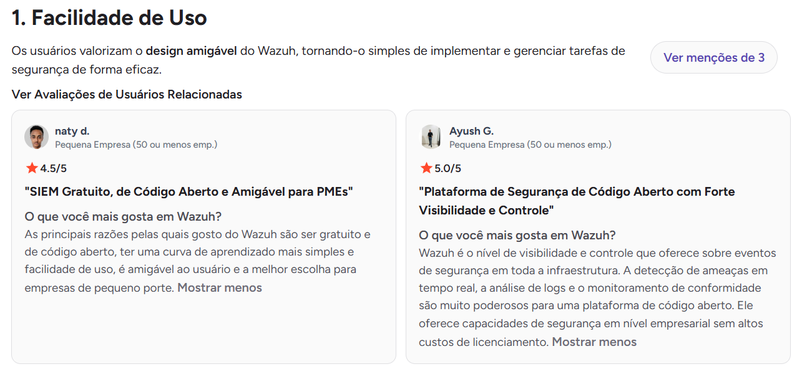
    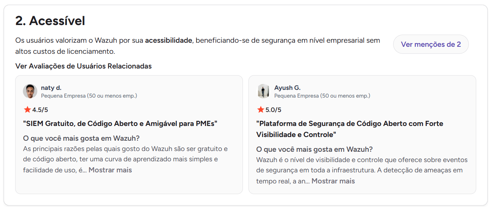
    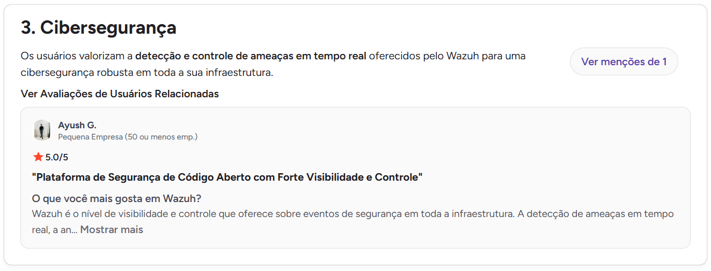
    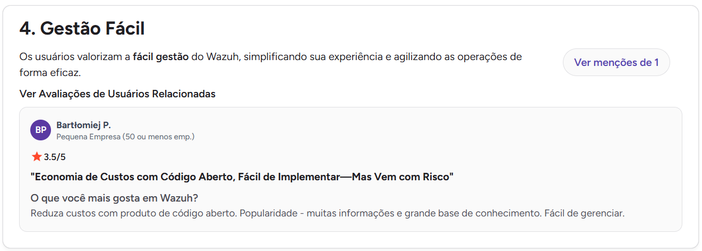
    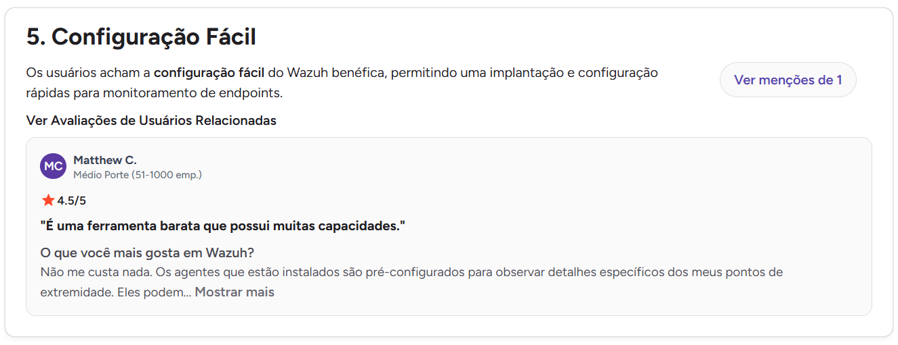
    - Avaliações Negativas
    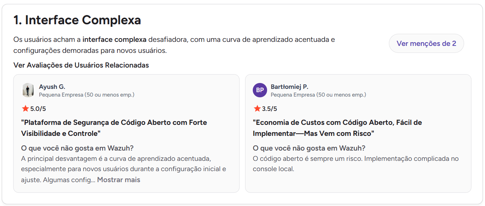
    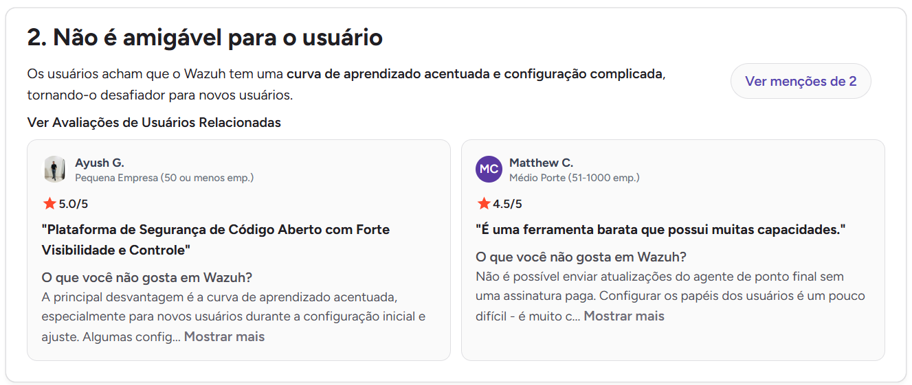
    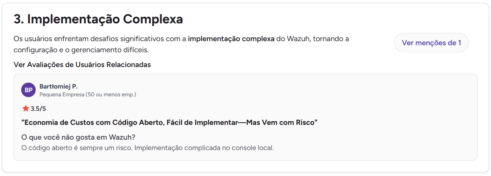
    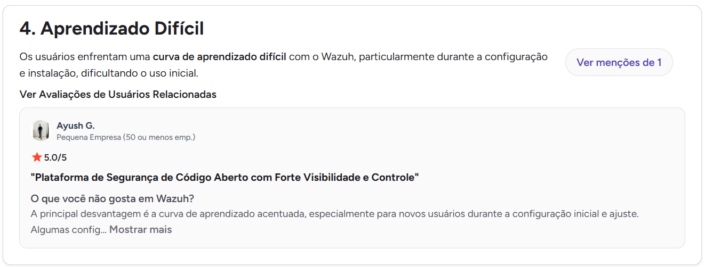
    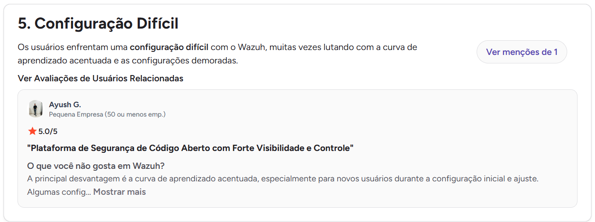
- Reddit: Opiniões Públicas sobre a ferramenta
    - Avaliações Positivas
    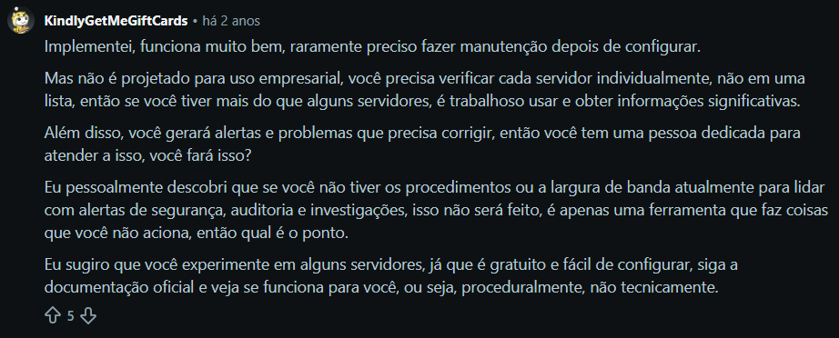
    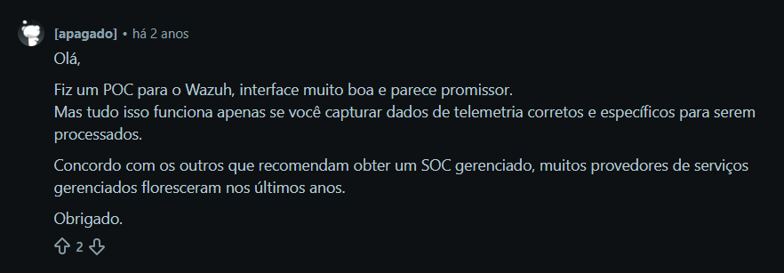
    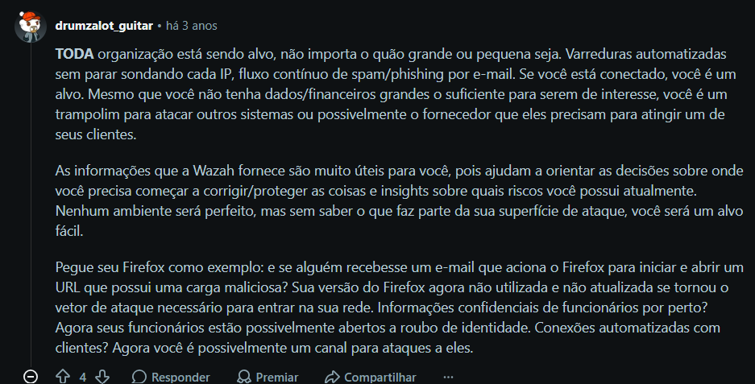
    - Avaliações Negativas
     
- Gartner: Reviews do Produto por Usuários
    - Avaliação Positiva da Ferramenta</b>
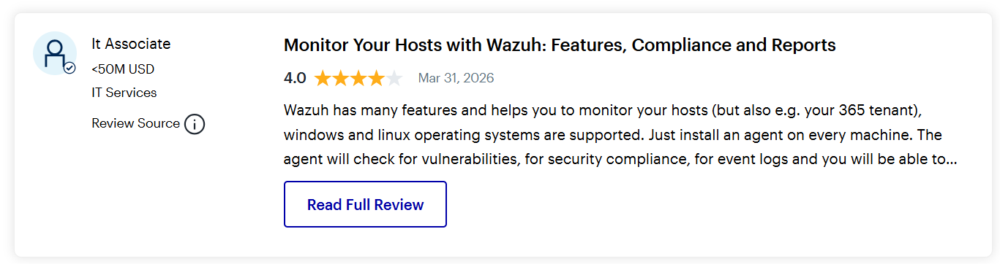

#### Preço/modelo de negócio

**(Professor comentou que não é necessário preenchimento)**

#### Padrões e tendências percebidos

- **Visão Geral e Navegação**:
    - Se baseia na combinação de visão geral, visualizações gráficas, tabelas, filtros e detalhamento progressivo.
    - Permite ao usuário transitar do panorama geral do ambiente para a investigação de eventos específicos.

- **Dashboards e Indicadores**:
    - Utiliza dashboards para apresentar múltiplos indicadores simultaneamente.
    - Oferece painéis específicos para diferentes atividades de segurança, além de permitir a criação de dashboards personalizados.

- **Filtros e Consultas (WQL)**:
    - Emprega a linguagem WQL (linguagem própria) para combinar condições e realizar buscas específicas.
    - Reduz o volume de informações exibidas ao usuário, facilitando a análise em diferentes áreas da plataforma.

- **Representação Temporal**:
    - Permite a criação de visualizações baseadas em intervalos de tempo.
    - Facilita o acompanhamento da ocorrência, evolução e tendências dos eventos de segurança.

- **Fluxo de Investigação (Visão Geral → Filtragem → Detalhamento)**:
    - Inicia com dados agregados para posterior restrição e aprofundamento de eventos específicos.

#### Pontos positivos, limitações e lições

| Ponto                                           | Evidência                                                                                                                                                      | Implicação para nosso projeto                                                                                                                                                                                                        |
| ----------------------------------------------- | -------------------------------------------------------------------------------------------------------------------------------------------------------------- | ------------------------------------------------------------------------------------------------------------------------------------------------------------------------------------------------------------------------------------ |
| Positivo: Navegação exploratória contínua       | Interatividade dos componentes visuais: gráficos clicáveis que aplicam filtros automáticos no painel                                                           | Lição: Nosso IDS não deve exibir predições do modelo de ML como relatórios estáticos. É fundamental permitir que o usuário interaja com as visualizações (ex: clicar no gráfico de tráfego anômalo para filtrar a tabela de eventos) |
| Positivo: Classificação por severidade          | O Wazuh utiliza níveis de severidade para os alertas, permitindo estabelecer limites para geração e tratamento de alertas                                      | Lição: O IDS pode utilizar níveis de prioridade ou severidade para auxiliar o usuário a identificar quais detecções devem ser analisadas primeiro                                                                                    |
| Positivo: Análise de Eventos                    | O Wazuh disponibiliza visualizações temporais para análise de eventos                                                                                          | Lição: A interface pode apresentar a distribuição das detecções ao longo do tempo para facilitar a identificação de picos, recorrências e possíveis incidentes                                                                       |
| Positivo: Personalização                        | O usuário pode criar dashboards e visualizações personalizados                                                                                                 | Lição: A personalização pode ser considerada caso o escopo do projeto permita diferentes perfis ou necessidades de análise                                                                                                           |
| Limitação: Grande quantidade de funcionalidades | A interface reúne uma série de recursos de monitoramento, investigação, configuração, conformidade e administração                                             | Lição: O projeto deve evitar reproduzir a complexidade do Wazuh e priorizar as tarefas diretamente relacionadas ao objetivo do IDS                                                                                                   |
| Limitação: Dependência de conhecimento técnico  | Recursos como WQL (linguaguem própria da plataforma) oferecem maior capacidade de consulta, mas exigem que o usuário conheça a sintaxe e os campos disponíveis | Lição: A interface do projeto deve priorizar mecanismos de filtragem simples e compreensão direta dos resultados, deixando consultas avançadas como recurso secundário, caso sejam necessárias                                       |

> Repita a subseção para C02, C03... até atender à quantidade da equipe.

## 3. Softwares que o público-alvo usa no cotidiano

Analise interfaces que moldam a expectativa do público, mesmo que não sejam concorrentes.

| Software | Por que o público usa | Padrões relevantes | Prints         | O que aprender |
| -------- | --------------------- | ------------------ | -------------- | -------------- |
| {{...}}  | {{...}}               | {{...}}            | {{link local}} | {{...}}        |

## 3.1 Padrões de interface relevantes ao escopo de IHC

Registre somente padrões encontrados nas soluções analisadas e que possam ter relação com objetivos reais da equipe.

A varredura considera **todos os softwares levantados na Entrega 1**, e não apenas os que receberam análise individual. As soluções descartadas por não possuírem interface gráfica própria (Snort, Suricata, Zeek, ClamAV) permanecem relevantes aqui como **contra-exemplos**: é justamente a ausência de camada visual nelas que evidencia a lacuna que o projeto pretende ocupar. Para leitura das evidências: `C01` e `C02` remetem às análises em profundidade deste documento; os demais produtos são citados a partir de documentação oficial e observação de suas interfaces públicas.

| Padrão observado                                          | Produto(s)                                                                                                                                                       | Para qual tarefa serve                                                                        | Vantagem percebida                                                                                               | Risco/limitação                                                                                                                                               | Aplicável ao nosso escopo?                                                                   |
| --------------------------------------------------------- | ---------------------------------------------------------------------------------------------------------------------------------------------------------------- | --------------------------------------------------------------------------------------------- | ---------------------------------------------------------------------------------------------------------------- | ------------------------------------------------------------------------------------------------------------------------------------------------------------- | -------------------------------------------------------------------------------------------- |
| Dashboard como ponto de entrada                           | C01 (Fortinet IDS), C02 (Wazuh), Splunk, Elastic SIEM, Datadog, Palo Alto (ACC), Security Onion, Sophos Central                                                  | Obter o panorama do ambiente monitorado antes de decidir o que investigar                     | Reduz a necessidade de consultar fontes separadas e permite perceber rapidamente o estado geral da rede          | Excesso de indicadores simultâneos dilui a atenção e transforma o painel em decoração; o usuário não sabe por onde começar                                    | **Sim** — mas com poucos indicadores, focados em "há algo anômalo agora?"                    |
| Recortes prontos do tráfego (origem / destino / sessão)   | C01 (dashboards `Fortigate_sources`, `Fortigate_Destinations`, `Fortigate_sessions`), Palo Alto (ACC), Zeek (`conn.log`)                                         | Responder perguntas frequentes do analista sem precisar montar consulta do zero               | O usuário chega à informação por um caminho já preparado, economizando esforço de formulação                     | Recortes fixos podem não cobrir a pergunta real, obrigando o retorno à consulta manual                                                                        | **Sim** — visões pré-definidas por origem, destino e fluxo das detecções                     |
| Classificação por severidade / prioridade                 | C02 (níveis 0–15 das regras), C01 (criticidade das assinaturas), Snort e Suricata (campo `priority` na regra), Elastic SIEM (*risk score*), Sophos, Cisco Secure | Decidir qual detecção analisar primeiro em meio a um volume alto de eventos                   | Convenção consolidada em todo o domínio: o analista já espera encontrá-la e sabe interpretá-la                   | Severidade mal calibrada gera fadiga de alerta e faz o usuário ignorar o próprio indicador                                                                    | **Sim** — essencial para triagem das detecções do modelo de ML                               |
| Histórico + filtros                                       | C02 (filtros e WQL), C01 (filtros dos dashboards), Splunk, Elastic SIEM, Datadog, Security Onion                                                                 | Restringir o conjunto de eventos e investigar um subconjunto específico                       | Diminui o volume exibido simultaneamente e viabiliza a investigação                                              | Filtro que zera o resultado sem explicar o porquê leva o usuário a concluir que "não há nada"                                                                 | **Sim** — filtros diretos na interface, com feedback de quantos eventos restaram             |
| Linguagem de consulta própria (SPL / WQL / KQL)           | Splunk (SPL), C02 (WQL), Elastic SIEM (KQL), Datadog                                                                                                             | Formular buscas complexas que os filtros prontos não alcançam                                 | Poder de expressão alto para o usuário experiente                                                                | Exige conhecer sintaxe e nomes de campos; foi apontado como barreira nas críticas ao Wazuh (limitações da C02)                                                | **Talvez** — somente como recurso secundário, nunca como caminho obrigatório                 |
| Visualização temporal / timeline                          | C02 (timelines e gráficos por intervalo), C01 (sessões com início e fim), Elastic SIEM (Timeline), Datadog, Splunk                                               | Identificar picos, recorrências e evolução das ocorrências                                    | Torna visível o padrão temporal que uma lista de eventos não revela                                              | Janela de tempo mal escolhida esconde o incidente ou exibe apenas ruído                                                                                       | **Sim** — distribuição das detecções ao longo do tempo, com seleção de período               |
| Detalhamento progressivo (visão geral → filtro → detalhe) | C02 (fluxo de investigação documentado), C01, Elastic SIEM, Splunk, Datadog, Security Onion (Hunt)                                                               | Investigar uma detecção a partir do panorama, sem perder o contexto                           | Permite aprofundar só quando necessário, mantendo a tela inicial legível                                         | Se os níveis não forem claros, o usuário se perde e não sabe como voltar                                                                                      | **Sim** — é o fluxo central previsto para a análise de detecções                             |
| Regra/assinatura como artefato textual editável           | Snort, Suricata, Zeek (scripts), C02 (regras XML), Elastic SIEM (*detection rules*), C01 (assinaturas FortiGuard)                                                | Definir e ajustar o que o sistema considera suspeito                                          | Transparência total sobre o critério de detecção; o analista audita a lógica                                     | Edição em texto puro é hostil ao usuário e propensa a erro sem validação; ausência de interface foi o motivo do descarte de Snort, Suricata e Zeek            | **Talvez** — expor o critério da detecção em linguagem legível, sem exigir edição de arquivo |
| Alerta acionável / monitor configurável                   | Datadog (*monitors*), Sophos, Cisco Secure, C02 (gestão de alertas), Elastic SIEM                                                                                | Ser avisado de uma condição sem precisar observar a tela continuamente                        | Desloca o esforço de vigilância do usuário para o sistema                                                        | Alerta demais produz insensibilização; alerta de menos produz falsa sensação de segurança                                                                     | **Talvez** — depende do escopo; se houver, com limiar ajustável pelo usuário                 |
| Status simplificado em linguagem cotidiana                | Windows Defender ("Seu dispositivo está protegido", histórico de proteção), ClamAV (resumo do *scan*)                                                            | Comunicar o estado de segurança a quem não é especialista                                     | Resposta imediata e sem jargão à pergunta "está tudo bem?"; é a convenção que **todo** o público-alvo já conhece | Simplificação excessiva esconde informação de que o analista precisa                                                                                          | **Sim** — como camada de entrada, com acesso ao detalhe técnico logo abaixo                  |
| Saída bruta em log/CLI (contra-exemplo)                   | Snort, Suricata (EVE JSON), Zeek, ClamAV                                                                                                                         | Registrar detecções de forma programática, para consumo por outra ferramenta                  | Formato leve, automatizável e integrável                                                                         | Sem camada visual, a interpretação depende inteiramente da experiência do operador — motivo pelo qual esses produtos foram descartados como referência de IHC | **Não** como interface — mas confirma a lacuna que o projeto se propõe a preencher           |
| Relatório e conformidade                                  | C02 (painéis PCI DSS e afins), Splunk, Palo Alto, Sophos, Cisco Secure                                                                                           | Consolidar resultados para registro, auditoria ou comunicação a terceiros                     | Materializa a análise em um artefato compartilhável                                                              | Não é a tarefa central durante a detecção; concorre com o esforço nas telas principais                                                                        | **Talvez** — apenas exportação simples do que já está na tela, se o escopo permitir          |
| Administração/CRUD                                        | C02 (agentes, regras, usuários), C01 (assinaturas e políticas), Palo Alto, Sophos, Cisco Secure                                                                  | Configurar o próprio sistema: regras, fontes monitoradas e parâmetros                         | Dá autonomia ao usuário para adaptar a detecção ao seu ambiente                                                  | O excesso de recursos administrativos foi a origem das críticas de complexidade ao Wazuh e ao FortiGate (limitações de C01 e C02)                             | **Talvez** — restrito ao mínimo e fora da navegação principal                                |
| Personalização de painéis                                 | C02 (dashboards personalizados), Splunk, Datadog, Elastic SIEM                                                                                                   | Adaptar a apresentação às prioridades de cada perfil de usuário                               | Atende necessidades distintas sem exigir uma tela por perfil                                                     | Alto custo de implementação e de aprendizado; pode ser desnecessário para um público reduzido                                                                 | **Talvez** — depende do escopo final e da existência de perfis distintos                     |
| Comparação de resultados entre períodos                   | Datadog (sobreposição de período anterior), Splunk (*timeshift*), Elastic SIEM                                                                                   | Verificar se o volume ou o perfil das detecções mudou em relação a um intervalo de referência | Distingue o comportamento anômalo do que é rotina naquele ambiente                                               | Comparação sem uma linha de base confiável induz a conclusões erradas                                                                                         | **Talvez** — útil para justificar por que o modelo classificou um tráfego como anômalo       |
| Agregação de múltiplas ferramentas em um console único    | Security Onion (Snort + Suricata + Zeek + Elastic), Sophos Central, Cisco Secure, C02 (Wazuh como ecossistema)                                                   | Reunir detecções de fontes distintas em um único ponto de trabalho                            | Evita a troca de contexto entre ferramentas durante a investigação                                               | Interface resultante tende a ser heterogênea, com terminologia e padrões visuais inconsistentes entre módulos                                                 | **Não** — fora do escopo; reforça a decisão de manter uma interface única e coesa            |

> O objetivo não é concluir “todo concorrente tem dashboard, então teremos um”. O padrão só será adotado se apoiar uma tarefa rastreável.

## 4. Síntese comparativa da equipe

Comparação restrita às duas soluções com análise em profundidade neste documento: **C01 — Fortinet IDS** (concorrente direto) e **C02 — Wazuh Dashboard** (análogo indireto).

| Critério                              | C01 — Fortinet IDS                                                                                                                                                                                                                                         | C02 — Wazuh Dashboard                                                                                                                                                                                          | Oportunidade para o projeto                                                                                                                                                               |
| ------------------------------------- | ---------------------------------------------------------------------------------------------------------------------------------------------------------------------------------------------------------------------------------------------------------- | -------------------------------------------------------------------------------------------------------------------------------------------------------------------------------------------------------------- | ----------------------------------------------------------------------------------------------------------------------------------------------------------------------------------------- |
| Navegação                             | Organizada por recortes prontos do tráfego (origem, destino, sessões), o que encurta o caminho até perguntas frequentes; em contrapartida, os relatos de usuários apontam grande quantidade de menus e opções de configuração competindo pelo mesmo espaço | Fluxo explícito de visão geral → filtragem → detalhamento, com gráficos clicáveis que aplicam filtros no painel; a amplitude de módulos (monitoramento, conformidade, administração) dilui o caminho principal | Manter o fluxo exploratório da C02 e os recortes prontos da C01, mas com **um único caminho principal** de investigação e configurações fora da navegação central                         |
| Feedback/estado                       | O estado é comunicado por contagens e listas de conexões; a resposta a "o ambiente está bem agora?" exige interpretação do próprio analista                                                                                                                | Severidade e volume de alertas dão indicação imediata de criticidade; a interatividade dos gráficos confirma visualmente o filtro aplicado                                                                     | Oferecer um **estado sintético do ambiente** logo na entrada e feedback explícito de filtro ativo (quantos eventos restaram, qual critério está aplicado)                                 |
| Prevenção/recuperação de erro         | Não há evidência, nas fontes consultadas, de mecanismos de desfazer ou de confirmação nas ações de análise; o risco recai sobre configuração de políticas                                                                                                  | O uso de WQL permite consultas sintaticamente válidas mas semanticamente erradas, sem sinalização de que o resultado vazio pode ser erro do filtro                                                             | Tratar **resultado vazio como estado explicável** ("nenhuma detecção com estes filtros — remover filtro X") e permitir desfazer/limpar filtros em um clique                               |
| Terminologia                          | Nomenclatura de rede densa (sessões, origens, destinos, assinaturas, *exploit-facing*) apresentada sem apoio contextual na tela                                                                                                                            | Vocabulário próprio da plataforma (agentes, níveis 0–15, WQL) que exige familiaridade prévia; críticas no G2 e no Reddit citam complexidade e falta de amigabilidade                                           | Adotar termos do domínio já consagrados, mas **explicá-los na própria interface** (tooltips, legendas curtas) em vez de pressupor o repertório do usuário                                 |
| Transparência do critério de detecção | Boa rastreabilidade da origem do alerta: assinatura identificada e atualizada pelo FortiGuard Labs, com distinção entre *exploit-facing* e *vulnerability-facing*                                                                                          | A regra que gerou o alerta é identificável, com seu nível de severidade associado                                                                                                                              | Ponto crítico para um IDS baseado em ML: a interface deve dizer **por que** o tráfego foi classificado como anômalo, não apenas que foi — sob pena de o analista não confiar no resultado |
| Acessibilidade                        | Não avaliada nas fontes consultadas; observa-se dependência de codificação por cor para transmitir criticidade                                                                                                                                             | Não avaliada nas fontes consultadas; a mesma dependência de cor aparece nos painéis de severidade                                                                                                              | Lacuna comum às duas soluções: garantir **canal redundante à cor** (rótulo textual e/ou ícone para severidade) e contraste adequado — diferencial de baixo custo para o projeto           |
| Eficiência                            | Recortes pré-configurados e processamento em hardware dedicado favorecem a resposta rápida ao analista experiente                                                                                                                                          | Filtros, WQL e dashboards personalizados dão alta eficiência a quem domina a ferramenta                                                                                                                        | Buscar eficiência **sem exigir especialização prévia**: filtros diretos e visões prontas cobrindo as tarefas mais frequentes, com consulta avançada como recurso opcional                 |
| Curva de aprendizado                  | Alta: relatos no Reddit e no PeerSpot indicam dependência de operador experiente e do ecossistema Fortinet para extrair o valor pleno                                                                                                                      | Alta: avaliações no G2 e no Reddit apontam interface complexa e difícil para quem está começando                                                                                                               | Nenhuma das duas atende bem ao usuário iniciante — abrir espaço para uma interface **compreensível de forma autônoma**, sem treinamento prévio                                            |
| Carga informacional                   | Densidade alta de dados de rede por tela, sem hierarquia clara entre o que é rotina e o que exige ação                                                                                                                                                     | Volume elevado de recursos e indicadores simultâneos, apontado como limitação na própria análise C02                                                                                                           | Priorizar: **poucos indicadores na entrada**, detalhe sob demanda, e nada na tela inicial que não apoie a decisão de "o que investigar primeiro"                                          |

## 5. Recomendações derivadas

Liste recomendações com origem explícita.

- **RC01:** {{recomendação}} — derivada de {{C01/C02/evidência}}.
- **RC02:** {{...}}

## Referências

- Gartner Peer Insights. Wazuh - The Open Source Security Platform. Disponível em: https://www.reddit.com/r/cybersecurity/comments/1d1wzzl/wazuh_pros_and_cons/. Acesso em: 27 ago. 2026 a 31 ago. 2026.

- G2: Avaliações de Software de Empresas. Wazuh. Disponível em: https://www.g2.com/pt/products/wazuh/reviews?qs=pros-and-cons. Acesso em: 27 ago. 2026 a 31 ago. 2026.

- Reddit. Wazuh vale a pena pra minha empresa?. Disponível em: https://www.reddit.com/r/Wazuh/comments/16gkvhh/is_wazuh_worth_it_for_my_company/?tl=pt-br. Acesso em: 27 ago. 2026 a 31 ago. 2026.

- Reddit. Wazuh vale a pena pra minha empresa?. Disponível em: https://www.reddit.com/r/cybersecurity/comments/1d1wzzl/wazuh_pros_and_cons/. Acesso em: 27 ago. 2026 a 31 ago. 2026.

- WAZUH. Wazuh dashboard – User manual. Documentação oficial. Disponível em: https://documentation.wazuh.com/current/user-manual/wazuh-dashboard/navigating-the-wazuh-dashboard.html. Acesso em: 27 ago. 2026 a 31 ago. 2026. 

- WAZUH. Wazuh dashboard – User manual. Documentação oficial. Disponível em: https://documentation.wazuh.com/current/user-manual/wazuh-dashboard/. Acesso em: 27 ago. 2026 a 31 ago. 2026.

- WAZUH. Wazuh dashboard – Components. Documentação oficial. Disponível em: https://documentation.wazuh.com/current/getting-started/components/wazuh-dashboard.html. Acesso em: 27 ago. 2026 a 31 ago. 2026.

- WAZUH. Filtering data using Wazuh Query Language (WQL). Documentação oficial. Disponível em: https://documentation.wazuh.com/current/user-manual/wazuh-dashboard/queries.html. Acesso em: 27 ago. 2026 a 31 ago. 2026.

- WAZUH. Creating custom dashboards. Documentação oficial. Disponível em: https://documentation.wazuh.com/current/user-manual/wazuh-dashboard/creating-custom-dashboards.html. Acesso em: 27 ago. 2026 a 31 ago. 2026.

- WAZUH. Alert management. Documentação oficial. Disponível em: https://documentation.wazuh.com/current/user-manual/manager/alert-management.html. Acesso em: 27 ago. 2026 a 31 ago. 2026.

## Checklist

- [ ] O mapa inicial de alternativas da Entrega 1 foi revisitado e aprofundado.
- [ ] Hipóteses relevantes sobre mercado/padrões foram atualizadas na rastreabilidade quando surgiram evidências.
- [ ] Há pelo menos uma análise completa por integrante.
- [ ] Cada análise contém prints legíveis da interface.
- [ ] Prints mostram telas/estados relevantes, não apenas logos/homepage.
- [ ] Foram analisados concorrentes e/ou interfaces representativas ao público.
- [ ] Em TCC sem interface original, foram investigadas ferramentas profissionais análogas às atividades do usuário escolhido.
- [ ] Padrões como dashboard, relatório, filtros e CRUD foram analisados como soluções para tarefas, não como requisitos automáticos.
- [ ] Opiniões de UX têm fonte.
- [ ] A síntese compara critérios comuns e produz recomendações.
- [ ] Não há “copiar porque o concorrente faz”; há justificativa de adequação ao público/contexto.
