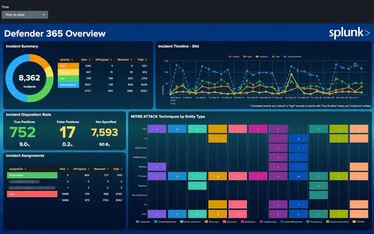
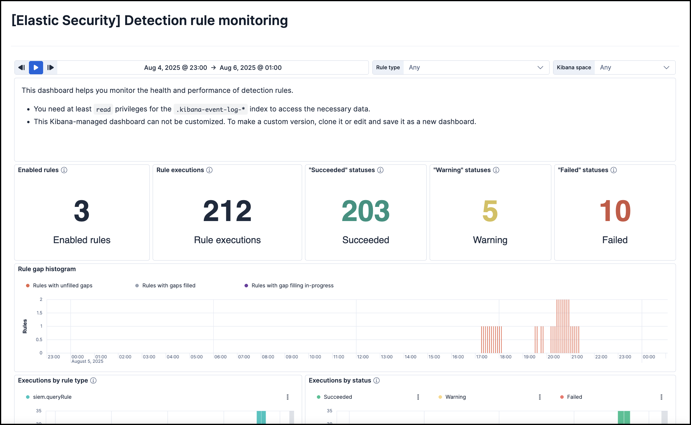
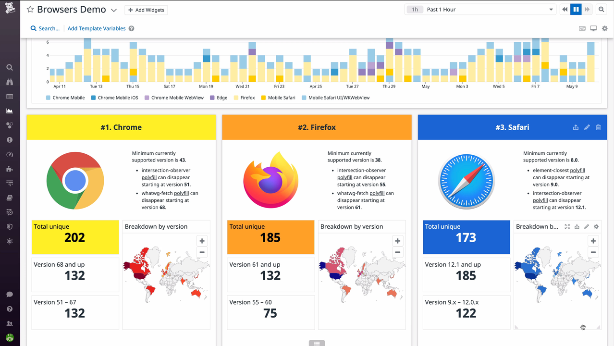
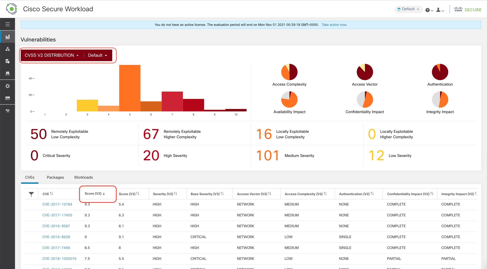
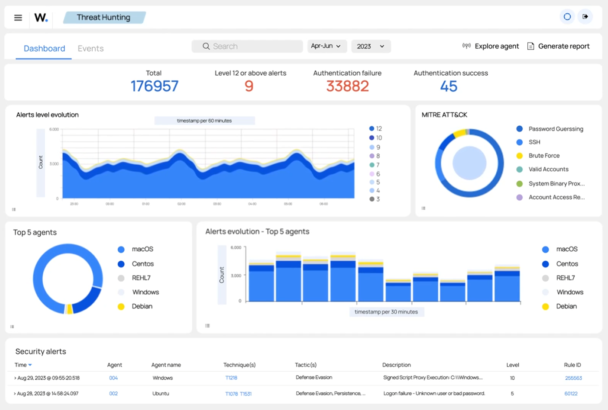
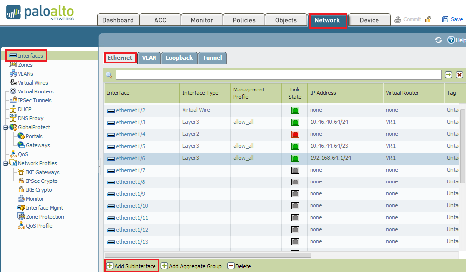
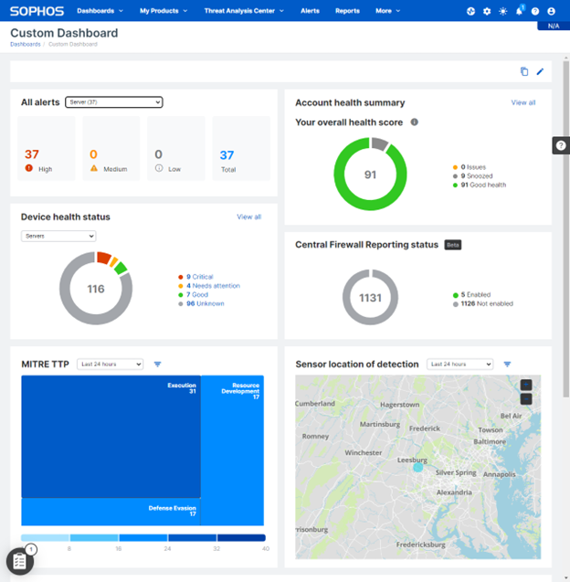
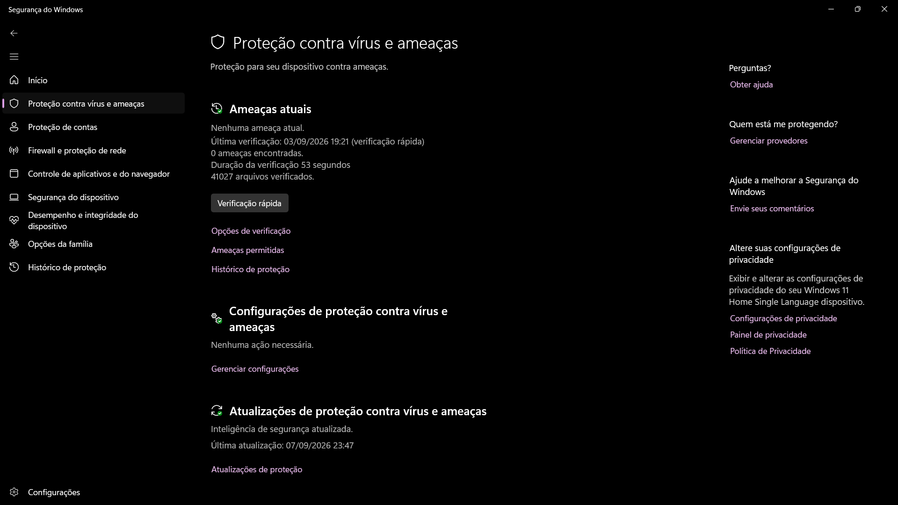
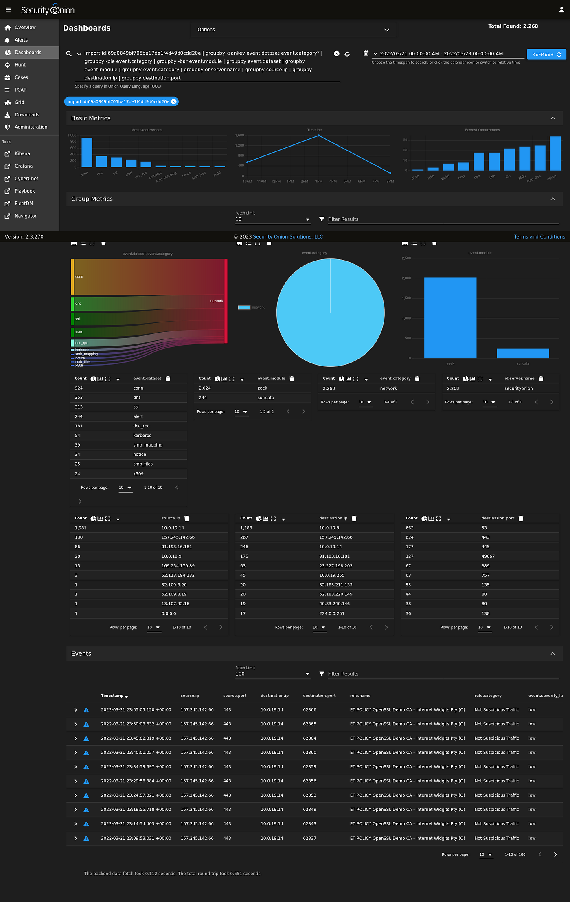
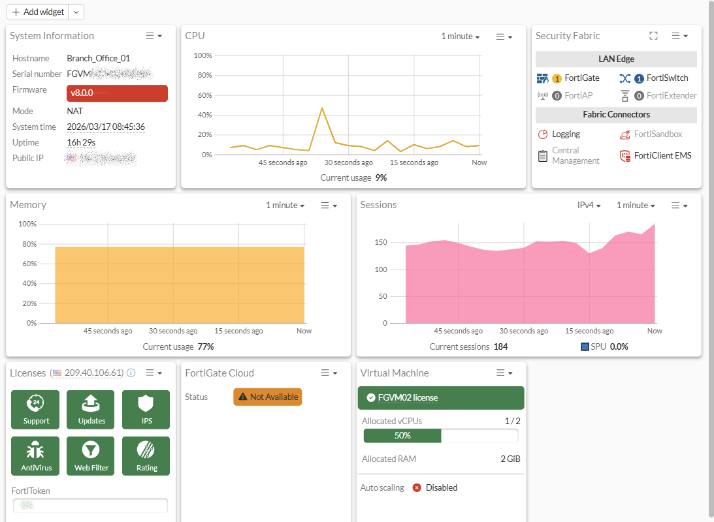

# Entrega 2 — Público-alvo e análise de concorrência

**Data:** 19/08/2026
**Status:** `🟩 concluída`
**Responsabilidade mínima:** cada integrante analisa pelo menos 1 concorrente/interface representativa; a equipe produz síntese comparativa.

## Objetivo da atividade

Compreender soluções do mesmo domínio **e também interfaces familiares ao público-alvo**. O objetivo não é copiar telas, mas identificar convenções, padrões, affordances percebidas, problemas recorrentes, expectativas e oportunidades de design.

> **Concorrente não precisa ser idêntico ao produto.** Pode atuar na mesma área, resolver objetivo semelhante ou disputar a mesma necessidade. Quando não houver concorrente direto, use produtos análogos e softwares que o público já utiliza.

### Para TCCs que não previam interface

Não procure apenas um “concorrente do algoritmo”. Investigue **interfaces profissionais que materializam atividades semelhantes** às que o usuário escolhido precisaria realizar.

Exemplos:

- TCC de banco de dados → consoles de administração, ferramentas para DBA, monitoramento e análise de consultas;
- TCC de LLM/ML → painéis de experimentos, gestão de modelos/datasets, comparação de métricas, revisão de resultados;
- TCC de análise de dados → dashboards, ferramentas de BI, filtros, relatórios e exploração;
- TCC de infraestrutura/API → portais administrativos, observabilidade, logs, gestão de credenciais e uso;
- TCC de cibersegurança → consoles de alertas, triagem, histórico e auditoria.

A pergunta é: **“que convenções esse perfil já conhece para executar tarefas equivalentes?”**

## Entrada obrigatória da Entrega 1

Retome o mapa inicial de alternativas e produtos citado na Entrega 1. Aqui a equipe deixa de trabalhar apenas com impressão inicial e passa a **investigar sistematicamente** cada solução.

| Item citado na Entrega 1 | Tipo | Por que foi citado | Status inicial | Decisão nesta entrega |
|---|---|---|---|---|
| Splunk |Análogo|Referência de mercado em SIEM, agregação de logs e dashboards complexos para analistas|H|Analisar|
| Elastic SIEM |Análogo|Padrão de mercado para visualização de logs; essencial para entender construção de dashboards|H|Analisar|
| Datadog |Análogo|Referência moderna em observabilidade, monitoramento de infraestrutura e alertas em tempo real|H|Analisar|
| Snort | Concorrente | O IDS de rede (NIDS) open-source mais tradicional da área, baseado em assinaturas | H | **Não selecionado para análise aprofundada.** Sua interface primária é log e linha de comando — que **são interfaces**, e aparecem em 3 e 3.1 como contra-exemplo de apresentação |
| Suricata | Concorrente | Principal alternativa moderna ao Snort; alta performance em inspeção de pacotes | H | **Não selecionado para análise aprofundada**, pelo mesmo motivo de Snort. A saída EVE JSON é examinada em 3.1 |
| Cisco Secure | Concorrente/Análogo | Solução corporativa de segurança de rede e detecção de intrusão | H | **Não selecionado para análise aprofundada** por limite de tempo da equipe. **Possui interface gráfica relevante** e é citado em 3 e 3.1 a partir da documentação oficial |
| Zeek | Concorrente | Framework de análise de rede com foco comportamental | H | **Não selecionado para análise aprofundada.** Produz logs estruturados (`conn.log`), usados em 3.1 como referência de reconstrução de contexto |
| Wazuh | Concorrente | Ecossistema open-source completo; referência consolidada para visualização de alertas | F | **Selecionado — análise C02** |
| ClamAV | Análogo | Ferramenta clássica e open-source para detecção de malwares | H | **Não selecionado para análise aprofundada.** O resumo de varredura é usado em 3.1 como exemplo de comunicação de estado em linguagem simples |
| Palo Alto | Análogo | Firewall de próxima geração corporativo com IDS/IPS embutido | H | **Não selecionado para análise aprofundada** por limite de tempo. **Possui interface gráfica relevante**; a captura disponível (`paloalto.png`) é de configuração de interfaces de rede e **não** do painel ACC — ver a ressalva em 3 |
| Sophos | Concorrente/Análogo | Plataforma comercial de firewall e caça a ameaças | H | **Não selecionado para análise aprofundada** por limite de tempo. Possui console gráfico, citado em 3 a partir da documentação oficial |
| Windows Defender | Ferramenta cotidiana | Solução de segurança amplamente distribuída | H | **Não selecionado para análise aprofundada**, por não ser do domínio de rede. **Possui interface gráfica**, usada em 3.1 como exemplo de status em linguagem cotidiana |
| Security Onion | Concorrente | Distribuição que agrupa Snort, Suricata, Zeek e Elastic | H | **Não selecionado para análise aprofundada** por limite de tempo. **Possui dashboards próprios**, citados em 3 e 3.1 |
| Fortinet IDS | Concorrente | Solução de detecção de intrusão associada aos *appliances* líderes de mercado | H | **Selecionado — análise C01** (FortiView/FortiGate) |

> **Correção desta revisão (feedback E02, item 4):** a coluna de decisão dizia antes “Descartar, não possui interface gráfica nativa relevante para análise de IHC” para dez produtos — e a seção 3 em seguida apresentava capturas de vários deles. Duas coisas foram separadas:
>
> - **Não selecionar para análise aprofundada** é uma decisão de escopo da equipe, tomada por limite de tempo e pela ausência de acesso a algumas plataformas. Dois produtos (C01 e C02) recebem análise completa; os demais entram como referência pontual.
> - **Não possuir interface gráfica** é uma afirmação sobre o produto — e era falsa para Cisco Secure, Palo Alto, Sophos, Windows Defender e Security Onion, que têm console próprio.
>
> Além disso, **log e linha de comando são interfaces**. A saída em texto de Snort, Suricata, Zeek e ClamAV é uma forma de apresentação com suas próprias convenções e limitações, e é assim que elas aparecem em 3.1. A ausência de camada visual nessas ferramentas **não comprova**, por si, uma lacuna de mercado: ela indica que esses produtos foram projetados para serem consumidos por outra ferramenta, e não diretamente por uma pessoa.

Se uma hipótese da Entrega 1 for confirmada ou refutada durante esta análise, atualize `H01`, `H02`... em [`../RASTREABILIDADE.md`](../RASTREABILIDADE.md).

## 1. Público-alvo desta análise

**Público prioritário, retomado da Entrega 01 (seção 7.2):** o **Analista de Segurança de Rede (analista SOC)**. É esse perfil que orienta a leitura das interfaces: o que foi procurado em cada produto é como ele apoia **observar o estado da rede** (A01) e **investigar uma conexão sinalizada** (A02).

**Públicos secundários:** administradores de rede, que configuram o ambiente e trocam o classificador ativo (A03). Gestores permanecem como *stakeholders*, sem persona na disciplina (Entrega 01, 2.2).

> **Nota de revisão (feedback E02, Recomendações):** a redação anterior listava “analistas SOC, administradores de rede e pesquisadores/gestores de TI” em pé de igualdade, ampliando o recorte da Entrega 01 sem dizer. A hierarquia de prioridade foi restabelecida.

## 2. Concorrentes diretos/indiretos

### Análise C01 — Fortinet IDS

**Autor(a):** Lucas Kerr do Amaral — RA 22.123.032-9
**Produto/módulo observado:** FortiView, no FortiOS do FortiGate — **versão 7.4.12**, conforme a barra de status visível em `Fortigate_sessions.png`
**Tipo:** concorrente direto
**Origem das evidências:** capturas próprias de um FortiGate em operação (27/08/2026) + documentação oficial + relatos públicos de terceiros
**Link oficial:** [Fortinet — Intrusion Detection System](https://www.fortinet.com/br/resources/cyberglossary/intrusion-detection-system)
**Data de acesso:** 27/08/2026

> **Versão capturada × versão documentada (feedback E02, item 5):** as telas desta análise são da **7.4.12**. A referência de documentação citada em 3 aponta para o *Status dashboard* da **8.0.0**. Isso não invalida a análise, mas as duas coisas não devem ser lidas como a mesma fonte: o que afirmamos sobre layout vem das capturas; o que vem da documentação está marcado como tal.

#### Contexto e proposta

O Fortinet IDS (Sistema de Detecção de Intrusões) tem como proposta monitorar continuamente o tráfego de rede para identificar e alertar sobre atividades suspeitas, maliciosas ou desvios de conformidade em tempo real. Integrado ao ecossistema da plataforma Fortinet — como parte dos recursos nativos do sistema FortiOS nos firewalls FortiGate —, ele atua na camada de segurança cibernética preventiva e analítica, fornecendo visibilidade profunda contra ameaças conhecidas e emergentes sem interromper o fluxo operacional, servindo de base essencial para que equipes de TI e SOC reajam rapidamente a potenciais invasões.

#### Funcionalidades relevantes

| Funcionalidade               | Como é realizada                           | Evidência/print                                        | Observação de IHC                                                                               |
| ---------------------------- | ------------------------------------------ | ------------------------------------------------------ | ----------------------------------------------------------------------------------------------- |
| Recorte do tráfego por **origem** | Item próprio de menu que abre uma lista de origens com volume associado; o analista chega a “quem gerou mais tráfego” sem montar consulta | [`Fortigate_sources.png`](../assets/02_concorrencia/Fortigate_sources.png) — captura própria, FortiView 7.4.12 | **Observável:** o caminho até uma pergunta frequente já vem preparado, o que encurta a etapa de montar a consulta em A02. **Não observável na captura:** se o analista consegue ir da origem até a conexão individual sem perder o filtro |
| Recorte do tráfego por **destino** | Mesma estrutura, invertendo o eixo da pergunta | [`Fortigate_Destinations.png`](../assets/02_concorrencia/Fortigate_Destinations.png) — captura própria | **Observável:** origem e destino são telas irmãs com a mesma organização, o que reduz o custo de aprender a segunda depois da primeira |
| Lista de **sessões** com atributos da conexão | Tabela com origem, destino, protocolo, portas, bytes, pacotes e duração em colunas | [`Fortigate_sessions.png`](../assets/02_concorrencia/Fortigate_sessions.png) — captura própria | **Observável:** a captura mostra **os atributos listados acima**, lado a lado, numa única linha por conexão — exatamente o conjunto que a Entrega 01 (4.3) supõe necessário para interpretar uma ocorrência. **Limite:** a tela é um *snapshot* da lista; ela **não demonstra** a reconstrução completa do ciclo entre início e encerramento da sessão, nem explicação da detecção por assinatura. Para afirmar isso seria preciso uma sequência de telas, que não foi capturada |

> **Correção desta revisão (feedback E02, item 2):** a leitura anterior descrevia as três telas como “filtros” e atribuía à tela de sessões a reconstrução do ciclo de vida da conexão. O que a captura sustenta é a **presença dos atributos em colunas**; o acompanhamento do início ao encerramento é comportamento dinâmico e exigiria evidência de interação. A afirmação foi reduzida ao que a imagem mostra.

#### Experiência do usuário e opiniões

Relatos de terceiros, lidos como **opiniões situadas** — não como medição de usabilidade nem como descrição do público deste projeto:

| Fonte | O que o relato diz | Alcance da conclusão |
|---|---|---|
| [Reddit — *Your Pros/Cons with Fortinet*](https://www.reddit.com/r/fortinet/comments/1bnjllk/your_proscons_with_fortinet/) | Usuários citam grande volume de menus e opções de configuração | Relato de pessoas autosselecionadas num fórum do produto. Sustenta que **alguns usuários percebem** densidade de navegação; não mede curva de aprendizado nem descreve o analista deste projeto |
| [PeerSpot — *Cloud IDS vs Fortinet FortiGate*](https://www.peerspot.com/products/comparisons/cloud-ids_vs_fortinet-fortigate) | O valor pleno do produto depende de integração com outros produtos Fortinet e de operadores experientes | Comparação comercial entre produtos. Sustenta a percepção de **dependência de ecossistema**; não é avaliação de interface |

#### Preço/modelo de negócio

> **(Professor comentou que não é necessário preenchimento)**

#### Padrões e tendências percebidos

**Padrões de interface observados nas capturas** — este é o conteúdo pertinente à disciplina:

- **Menu como índice de perguntas, não de entidades.** Os itens do FortiView são nomeados pelo eixo da análise (Sources, Destinations, Sessions) e não pelo objeto técnico. O analista escolhe **a pergunta** antes de ver dados. *Evidência: barra lateral visível nas três capturas.*
- **Mesma gramática visual entre recortes.** Origem e destino repetem colunas, ordenação e posição dos controles. Aprender uma tela transfere para a outra. *Evidência: comparação entre `Fortigate_sources.png` e `Fortigate_Destinations.png`.*
- **Densidade alta de colunas por linha.** A tela de sessões exibe sete ou mais atributos por conexão simultaneamente, sem hierarquia visual que distinga o que é rotina do que exige ação. *Evidência: `Fortigate_sessions.png`.*
- **Estado da sessão e da consulta visível no topo.** Período, interface monitorada e contagem aparecem junto da tabela, de modo que o analista sabe **sobre qual conjunto** está olhando. *Evidência: cabeçalho das capturas.*
- **Terminologia de rede sem apoio contextual.** “Sessions”, “Sources”, “Bytes” e “Duration” aparecem como rótulos nus, sem definição, *tooltip* ou legenda na própria tela. *Evidência: cabeçalhos de coluna nas capturas.*

**Características técnicas do produto** — contextualizam o concorrente, mas **não são padrões de interface** e não foram observadas nas telas (vieram da documentação e do material institucional):

- Abordagem de assinatura dupla (*exploit-facing* × *vulnerability-facing*), que permite mitigar variantes de um mesmo ataque.
- Descarregamento de processamento em chips dedicados (SPUs/NPAs) para inspeção profunda de pacotes.
- Inspeção de tráfego criptografado (SSL/TLS DPI).
- Assinaturas para protocolos industriais (Modbus, DNP3, IEC 60870-5-104) e descoberta de dispositivos IoT.
- Atualização contínua de assinaturas pelo FortiGuard Labs.

> **Correção desta revisão (feedback E02, item 5):** esta seção tratava apenas de assinaturas, hardware dedicado, tráfego criptografado e protocolos industriais — conteúdo técnico que descreve o produto, não sua interface. Os dois blocos foram separados e o primeiro foi escrito a partir do que as capturas realmente mostram.
>
> **O que também foi retirado:** a ligação entre **processamento dedicado** e **eficiência do analista**. Chips de inspeção evitam gargalo de CPU; eles não dizem nada sobre o esforço humano de localizar uma conexão e interpretar o que aconteceu. É a mesma confusão entre desempenho computacional e qualidade de uso apontada no feedback da Entrega 01.

#### Pontos positivos, limitações e lições

| Ponto                                                     | Evidência                                                                                                                                                                                | Implicação para nosso projeto                                                                                                                                                                                                             |
| --------------------------------------------------------- | ------------------------------------------------------------------------------------------------------------------------------------------------------------------------------------------ | ------------------------------------------------------------------------------------------------------------------------------------------------------------------------------------------------------------------------------------------- |
| Positivo: recortes do tráfego prontos por eixo de análise | **Observado:** telas separadas de origem, destino e sessões, com a mesma organização ([`Fortigate_sources.png`](../assets/02_concorrencia/Fortigate_sources.png), [`Fortigate_Destinations.png`](../assets/02_concorrencia/Fortigate_Destinations.png), [`Fortigate_sessions.png`](../assets/02_concorrencia/Fortigate_sessions.png)) | **Achado:** o caminho até perguntas frequentes vem preparado. **Implicação para A02:** o analista gasta menos passos montando a consulta e mais passos interpretando o resultado. **Recomendação:** RC02 |
| Positivo: atributos da conexão reunidos numa linha | **Observado:** origem, destino, protocolo, portas, bytes, pacotes e duração em colunas de uma mesma linha (`Fortigate_sessions.png`) | **Achado:** o contexto da conexão está todo à vista, sem navegação adicional. **Implicação para A02:** nossa detecção deve chegar ao analista **vinculada ao fluxo que a originou**, não como evento solto. **Hipótese relacionada:** H13. **Recomendação:** RC02 |
| Positivo: estado da consulta visível | **Observado:** período e escopo da consulta exibidos junto da tabela | **Achado:** o usuário sabe sobre qual conjunto está olhando. **Implicação:** cada filtro aplicado precisa ser visível e reversível. **Recomendação:** RC04 |
| Limitação: densidade alta sem hierarquia | **Observado:** sete ou mais colunas por linha, sem destaque para o que exige ação (`Fortigate_sessions.png`) | **Achado:** tudo tem o mesmo peso visual. **Implicação:** a visão inicial do nosso painel deve distinguir rotina de exceção. **Recomendação:** RC01 |
| Limitação: terminologia sem apoio na tela | **Observado:** rótulos de coluna sem definição, legenda ou *tooltip* | **Achado:** a tela pressupõe vocabulário de rede. **Implicação:** termos próprios do nosso modelo (categoria prevista, confiança) precisam de explicação na própria tela. **Recomendação:** RC03 |
| Limitação: densidade de navegação | **Relatado por terceiros** (Reddit) — volume de menus e opções | **Achado:** percepção de complexidade por parte de alguns usuários. **Implicação:** limitar a navegação principal às tarefas do núcleo (A01 e A02). **Ressalva:** relato situado, não medição |
| Limitação: dependência de ecossistema e de operador experiente | **Relatado por terceiros** (PeerSpot) | **Achado:** o valor percebido depende de contexto de adoção. **Implicação:** nossa interface deve ser compreensível sem pressupor plataforma anterior. **Ressalva:** comparação comercial, não avaliação de usabilidade |

> **Correções desta revisão (feedback E02, itens 2 e 5):**
>
> - **Retirado “Rastreabilidade do ciclo de vida da conexão”** como ponto positivo observado. A tela de sessões mostra atributos da conexão; ela não demonstra o acompanhamento do início ao encerramento. A lição que sobrevive — vincular a detecção ao fluxo que a originou — foi mantida com a evidência correta.
> - **Retirado “Correlação com inteligência de ameaças”** como lição sobre explicabilidade. A existência do FortiGuard Labs **não permite deduzir** que o nosso modelo de ML consiga fornecer explicação equivalente: uma assinatura é uma regra auditável e nomeada; a saída de um classificador é uma probabilidade. São formas diferentes de justificar uma detecção. Ver RC03.
> - **Retirado “Detecção baseada na vulnerabilidade”** como lição de agrupamento de alertas. A assinatura dupla é uma técnica de detecção; **não se deduz dela** um padrão de agrupamento na interface.
> - Cada linha passou a seguir a cadeia **achado → evidência → implicação para a tarefa → recomendação**, e a origem de cada evidência (observação própria, documentação ou relato de terceiro) está marcada.

---

### Análise C02 — Wazuh Dashboard

**Autor(a):** Marcela Nalesso — RA 22.222.011-3
**Produto/módulo observado:** Wazuh Dashboard — módulos *Security Events*, *Vulnerability Detection*, *Discover* e *Custom dashboards*
**Tipo:** concorrente indireto/análogo
**Origem das evidências:** capturas de ambiente de demonstração e documentação oficial (23 a 31/08/2026), além de relatos públicos de terceiros em G2, Reddit e Gartner Peer Insights
**Link oficial:** [Wazuh](https://wazuh.com/) — [documentação do dashboard](https://documentation.wazuh.com/current/user-manual/wazuh-dashboard/)
**Data de acesso:** 23/08/2026 a 31/08/2026

#### Contexto e proposta

O Wazuh é uma plataforma open-source voltada à segurança de endpoints e monitoramento de ambientes, disponibilizando recursos para análise e visualização de dados de segurança. O Wazuh Dashboard funciona como uma interface central para acompanhamento de eventos, alertas e informações relacionadas aos ativos monitorados. Além disso, é possível que o usuário consiga uma visão geral do ambiente e acessar informações mais específicas para investigação. A ferramenta foi selecionada como interface análoga ao projeto por apresentar uma abordagem consolidada para visualização e investigação de eventos de segurança.

#### Funcionalidades relevantes

| Funcionalidade               | Como é realizada                                                                                                                                                                     | Evidência/print                                                                                                                           | Observação de IHC                                                                                                                                        |
| ---------------------------- | ------------------------------------------------------------------------------------------------------------------------------------------------------------------------------------ | ----------------------------------------------------------------------------------------------------------------------------------------- | -------------------------------------------------------------------------------------------------------------------------------------------------------- |
| Dashboard de segurança | Painel que agrega indicadores do ambiente monitorado em uma tela de entrada | [`ex_dashboard.png`](../assets/02_concorrencia/ex_dashboard.png) | **Observável:** a tela reúne indicadores que de outro modo estariam em fontes separadas. **Implicação para A01:** uma visão de entrada permite ao analista decidir *se* há algo a investigar antes de escolher *o quê* |
| Visualização de alertas | Eventos processados são apresentados como alertas numa tela própria | [`tela_alertas.png`](../assets/02_concorrencia/tela_alertas.png) | **Observável:** os eventos têm um lugar dedicado, separado do panorama. **Implicação para A02:** a ocorrência a investigar não precisa ser garimpada no meio do painel geral |
| Severidade por nível | O módulo **Vulnerability Detection** classifica itens em Critical, High, Medium e Low, com rótulo textual junto da cor | [`nivel_severidade.png`](../assets/02_concorrencia/nivel_severidade.png) | **Observável:** a escala existe e cada nível traz **rótulo textual** (“Critical - Severity”, “High - Severity”…), não apenas cor. **Limite importante:** este painel é de **vulnerabilidades**, não de alertas de intrusão. A captura **não comprova** a escala 0–15 das regras do Wazuh, nem severidade produzida por ML — ver a correção abaixo |
| Filtros e consulta textual | Barra de consulta sobre os campos do evento, combinada com filtros e seletor de período | [`wlq1.png`](../assets/02_concorrencia/wlq1.png) e [`wlq2.png`](../assets/02_concorrencia/wlq2.png) | **Observável:** `wlq1.png` mostra a barra **WQL** no módulo MITRE ATT&CK. **Limite:** a barra vista em `eventos.png` (módulo *Discover*) exibe **DQL**, que é outra linguagem. Não descrever toda consulta do produto como WQL |
| Visualização temporal | Histogramas e séries por intervalo de tempo | [`visualizacao_tempo.png`](../assets/02_concorrencia/visualizacao_tempo.png) | **Observável:** a distribuição no tempo fica visível, revelando concentração e recorrência que uma lista não mostra |
| Detalhamento do evento | Tela *Discover*: campos detalhados do evento, filtro temporal, **contagem de resultados** e identificação da regra que gerou o alerta | [`eventos.png`](../assets/02_concorrencia/eventos.png) | **Observável:** a contagem de resultados e a regra responsável aparecem na tela. **Implicação para A02:** saber **quantos** eventos restaram após o filtro e **qual critério** produziu o alerta dá ao analista base para confiar — ou desconfiar — do resultado |
| Dashboards personalizados | O usuário monta painéis próprios a partir das visualizações disponíveis | [`personalizacao1.png`](../assets/02_concorrencia/personalizacao1.png), [`personalizacao2.png`](../assets/02_concorrencia/personalizacao2.png), [`personalizacao3.png`](../assets/02_concorrencia/personalizacao3.png) | **Observável:** a montagem é possível e envolve várias etapas. **Ressalva:** que o analista **queira** ou **precise** montar o próprio painel é hipótese, não decorre de o concorrente oferecer a função |

> **Correções desta revisão (feedback E02, itens 2 e 6):**
>
> - **Nomes de arquivo:** o texto referenciava `wql1.png` e `wql2.png`, que não existem. Os arquivos no repositório são [`wlq1.png`](../assets/02_concorrencia/wlq1.png) e [`wlq2.png`](../assets/02_concorrencia/wlq2.png). As referências foram corrigidas.
> - **WQL × DQL:** `eventos.png` mostra a barra **DQL** no módulo *Discover*; **WQL** aparece em `wlq1.png`, no módulo MITRE ATT&CK. São linguagens distintas e o texto as tratava como a mesma.
> - **Severidade:** `nivel_severidade.png` é o painel **Vulnerability Detection**. Ele exemplifica uma **escala de severidade com rótulo textual**, e é isso que aproveitamos. Ele não é evidência da escala 0–15 das regras de alerta do Wazuh, nem de severidade calculada por modelo.
> - **Caminhos:** as referências usavam barra invertida (`assets\02_concorrencia\...`), que não resolve a partir de `docs/`. Todas passaram para caminho relativo com barra normal.

#### Experiência do usuário e opiniões

Os relatos abaixo são **opiniões situadas de terceiros**, não medições de usabilidade. Quem escreve numa página de avaliação ou num fórum é autosselecionado e opera num contexto que desconhecemos. Eles indicam **o que algumas pessoas percebem**; não descrevem o público deste projeto.

**G2 — avaliação média 4,5 de 5** ([fonte](https://www.g2.com/pt/products/wazuh/reviews?qs=pros-and-cons))

| Captura | O que o relato diz | Alcance |
|---|---|---|
| [`image-3.png`](../assets/02_concorrencia/image-3.png), [`image-6.png`](../assets/02_concorrencia/image-6.png) | Facilidade de uso elogiada | Há usuários que consideram a ferramenta fácil. Convive com os relatos opostos abaixo — os dois existem na mesma plataforma |
| [`image-4.png`](../assets/02_concorrencia/image-4.png) | “Acessível” | **Trata de custo/licenciamento, não de acessibilidade de interação.** Não serve como evidência sobre contraste, leitores de tela ou redundância textual |
| [`image-5.png`](../assets/02_concorrencia/image-5.png) | Cobertura de recursos de cibersegurança | Sobre capacidade do produto, não sobre a interface |
| [`image-7.png`](../assets/02_concorrencia/image-7.png) | Configuração elogiada | Experiência de implantação, perfil de administrador — não do analista em turno |
| [`image-8.png`](../assets/02_concorrencia/image-8.png), [`image-9.png`](../assets/02_concorrencia/image-9.png), [`image-10.png`](../assets/02_concorrencia/image-10.png), [`image-11.png`](../assets/02_concorrencia/image-11.png), [`image-12.png`](../assets/02_concorrencia/image-12.png) | Interface pouco amigável, complexa e difícil no início | Há usuários que percebem complexidade. **Não se deduz daí excesso de alertas irrelevantes** (ver H20): complexidade de navegação e ruído de alerta são problemas diferentes |

**Reddit** ([fonte 1](https://www.reddit.com/r/Wazuh/comments/16gkvhh/is_wazuh_worth_it_for_my_company/?tl=pt-br), [fonte 2](https://www.reddit.com/r/cybersecurity/comments/1d1wzzl/wazuh_pros_and_cons/))

| Captura | O que o relato diz | Alcance |
|---|---|---|
| [`image-13.png`](../assets/02_concorrencia/image-13.png) | **Relato misto:** elogia a ferramenta **e** faz ressalvas sobre esforço de operação e manutenção | Estava agrupado como “positivo”; na revisão passou a **misto**, que é o que o texto efetivamente diz |
| [`image-15.png`](../assets/02_concorrencia/image-15.png), [`image-16.png`](../assets/02_concorrencia/image-16.png) | Experiências positivas de adoção | Opinião de usuários de fórum |
| [`image-14.png`](../assets/02_concorrencia/image-14.png) | Críticas à ferramenta | Opinião de usuários de fórum |

**Gartner Peer Insights** — [?] **fonte a recuperar**

| Captura | O que o relato diz | Alcance |
|---|---|---|
| [`image-2.png`](../assets/02_concorrencia/image-2.png) | Avaliação positiva do produto, apresentada como reseña do Gartner | **Pendência:** a referência intitulada “Gartner Peer Insights” na lista de referências apontava para uma *thread* do Reddit, e não para o Gartner. Enquanto o endereço correto não for recuperado, esta captura **não deve ser citada** como evidência atribuída ao Gartner |

> **Correções desta revisão (feedback E02, itens 3 e 6):**
>
> - **`image-4.png` não é evidência de acessibilidade.** “Acessível” ali significa barato. Os dois sentidos foram separados.
> - **`image-13.png` foi reclassificada** de positiva para mista, por combinar elogio e ressalva de operação.
> - **“Nenhuma das duas atende bem ao usuário iniciante” e “todo o público-alvo já conhece” foram retiradas** da síntese. Os relatos são heterogêneos — há elogios **e** críticas à facilidade na mesma plataforma — e nenhum deles descreve o público específico deste projeto. Ver H28 (Entrega 01, 2.4).

#### Preço/modelo de negócio

**(Professor comentou que não é necessário preenchimento)**

#### Padrões e tendências percebidos

- **Visão Geral e Navegação**:
    - Se baseia na combinação de visão geral, visualizações gráficas, tabelas, filtros e detalhamento progressivo.
    - Permite ao usuário transitar do panorama geral do ambiente para a investigação de eventos específicos.

- **Dashboards e Indicadores**:
    - Utiliza dashboards para apresentar múltiplos indicadores simultaneamente.
    - Oferece painéis específicos para diferentes atividades de segurança, além de permitir a criação de dashboards personalizados.

- **Filtros e consulta textual**:
    - A plataforma oferece **duas** linguagens de consulta, dependendo do módulo: **WQL** (Wazuh Query Language), visível em [`wlq1.png`](../assets/02_concorrencia/wlq1.png) no módulo MITRE ATT&CK, e **DQL**, visível em [`eventos.png`](../assets/02_concorrencia/eventos.png) no módulo *Discover*.
    - Ambas reduzem o volume exibido, e ambas exigem conhecer sintaxe e nomes de campo — um custo de entrada que a análise registra como limitação.

- **Representação Temporal**:
    - Permite a criação de visualizações baseadas em intervalos de tempo.
    - Facilita o acompanhamento da ocorrência, evolução e tendências dos eventos de segurança.

- **Fluxo de Investigação (Visão Geral → Filtragem → Detalhamento)**:
    - Inicia com dados agregados para posterior restrição e aprofundamento de eventos específicos.

#### Pontos positivos, limitações e lições

| Ponto                                           | Evidência                                                                                                                                                      | Implicação para nosso projeto                                                                                                                                                                                                        |
| ----------------------------------------------- | -------------------------------------------------------------------------------------------------------------------------------------------------------------- | ------------------------------------------------------------------------------------------------------------------------------------------------------------------------------------------------------------------------------------ |
| Positivo: contagem de resultados visível após o filtro | **Observado** em [`eventos.png`](../assets/02_concorrencia/eventos.png): a tela *Discover* exibe quantos eventos restaram | **Achado:** o usuário sabe se o filtro foi longe demais ou de menos. **Implicação para A02:** cada filtro do nosso painel deve informar quantas conexões restaram. **Recomendação:** RC04 |
| Positivo: identificação do critério que gerou o alerta | **Observado** em `eventos.png`: a regra responsável aparece junto do evento | **Achado:** o usuário consegue auditar **por que** aquilo virou alerta. **Implicação:** nosso painel precisa de um equivalente — ver a ressalva de RC03 sobre a diferença entre regra e classificador |
| Positivo: escala de severidade com rótulo textual | **Observado** em [`nivel_severidade.png`](../assets/02_concorrencia/nivel_severidade.png) (módulo *Vulnerability Detection*): “Critical - Severity”, “High - Severity”, “Medium”, “Low” | **Achado:** a cor vem **acompanhada de texto**, não sozinha. **Implicação:** adotar a mesma redundância. **Limite:** é severidade de vulnerabilidades, não de alertas de intrusão nem de saída de modelo |
| Positivo: distribuição temporal dos eventos | **Observado** em [`visualizacao_tempo.png`](../assets/02_concorrencia/visualizacao_tempo.png) | **Achado:** picos e recorrências ficam visíveis. **Implicação para A01:** apresentar a distribuição das detecções no tempo, não só a lista |
| Positivo: separação entre panorama e detalhe | **Observado** na existência de telas distintas: [`ex_dashboard.png`](../assets/02_concorrencia/ex_dashboard.png), [`tela_alertas.png`](../assets/02_concorrencia/tela_alertas.png) e `eventos.png` | **Achado:** o produto separa “está tudo bem?” de “o que aconteceu nesta conexão?”. **Implicação:** base de RC01 e RC04. **Limite:** a sequência completa entre as telas **não foi capturada** — ver a correção abaixo |
| Limitação: amplitude de recursos na navegação principal | **Observado:** o menu reúne monitoramento, investigação, conformidade, configuração e administração. **Corroborado** por relatos de complexidade no G2 e no Reddit | **Achado:** a navegação principal carrega tarefas de perfis diferentes. **Implicação:** manter no nível principal apenas A01 e A02; configuração (A03) em área separada. **Recomendação:** RC01 |
| Limitação: consulta textual exige sintaxe | **Observado:** WQL (`wlq1.png`) e DQL (`eventos.png`) exigem conhecer sintaxe e campos | **Achado:** o poder de expressão tem custo de entrada. **Implicação:** filtros prontos no caminho principal, consulta textual como recurso secundário. **Recomendação:** RC04 |
| Limitação: personalização como tarefa adicional | **Observado** em [`personalizacao1.png`](../assets/02_concorrencia/personalizacao1.png)–[`personalizacao3.png`](../assets/02_concorrencia/personalizacao3.png): montar um painel envolve várias etapas | **Achado:** a flexibilidade transfere trabalho de configuração ao usuário. **Implicação:** personalização permanece **condicionada ao escopo**; que o analista precise dela não foi verificado |
| [?] Prevenção e recuperação de erro | **Não observado.** Nenhuma captura mostra filtro sem resultados, estado ambíguo ou retorno ao panorama depois do detalhamento | **Limitação da análise**, registrada em vez de preenchida com suposição. São estados que a Entrega 06 precisará prototipar — e sobre os quais os concorrentes não nos ensinaram nada ainda |

> **Correções desta revisão (feedback E02, itens 2 e 6, e Recomendações):**
>
> - **Retirado “gráficos clicáveis que aplicam filtros automáticos”** como achado observado. Isso é **comportamento dinâmico** e nenhuma captura o demonstra: seria preciso um par antes/depois do clique. A lição sobre interatividade passou a **proposta da equipe** em RC04.
> - **Severidade:** a linha anterior falava em “níveis de severidade dos alertas” com limites de geração e tratamento. A captura disponível é do painel de **vulnerabilidades**. O que ela sustenta — escala nomeada com rótulo textual — foi mantido; o resto saiu.
> - **Acrescentada a lacuna de prevenção e recuperação de erro**, conforme o modelo da entrega, registrada como limitação da análise.

> Repita a subseção para C02, C03... até atender à quantidade da equipe.

## 3. Softwares que o público-alvo usa no cotidiano

> **Alcance desta tabela (feedback E02, item 3):** ela registra **quais interfaces existem** e **quais convenções elas adotam** — isso é observável. Que o público deste projeto **use** ou **esteja habituado** a cada uma delas permanece hipótese (H28, H21) e só será verificado na Entrega 07. A coluna “Por que o público usa” descreve o posicionamento de cada produto, não um hábito medido.
>
> As telas mais densas — em especial a captura vertical de Security Onion (`so.png`) — devem ser consultadas em tamanho original no diretório [`assets/02_concorrencia/`](../assets/02_concorrencia/); a versão reduzida no Markdown serve apenas de referência.

| Software | Por que o público usa | Padrões relevantes | Prints | O que aprender |
| -------- | --------------------- | ------------------ | ------ | -------------- |
| Splunk | É uma referência em SIEM para busca, correlação e análise de logs em ambientes corporativos de segurança | dashboards de visão geral, busca textual, filtros temporais, tabelas de eventos, correlação de alertas | [Link onde mostra essas ferramentas](https://www.splunk.com/en_us/blog/tips-and-tricks/dashboard-studio-tabbed-dashboards.html) | O público espera que a investigação comece com uma visão geral e avance por filtros e busca, sem depender de leitura manual de logs brutos |
| Elastic SIEM | Usado para monitoramento, investigação e alertas em cenários de segurança ofensiva e operacionais | painéis de monitoramento, timeline, filtros por tempo e campo, visualização de eventos, severidade | [Link onde mostra essas ferramentas](https://www.elastic.co/docs/solutions/security/dashboards/detection-rule-monitoring-dashboard)  | A análise de incidentes é feita por hierarquia visual: panorama → filtros → detalhe; essa sequência deve estar clara na interface |
| Datadog | Muito utilizado em operação de TI para monitoramento de infraestrutura, alertas e métricas em tempo real | gráficos temporais, alertas configuráveis, painel de saúde, indicadores de serviço e infraestrutura | [Link onde mostra essas ferramentas](https://www.datadoghq.com/product/platform/dashboards/)  | O usuário percebe melhor o estado do ambiente quando há métricas resumidas, alertas e contexto temporal em um único lugar |
| Snort | [H] Referência em detecção por assinatura, citada por analistas de rede e pesquisadores de IDS | regras de detecção, alertas em log, listagem de eventos, base de assinaturas | [Snort 3 — *Alert Logging*](https://docs.snort.org/start/alert_logging) — sem captura: a saída é textual | **Log é interface.** A saída em texto é legível por outra ferramenta e densa para uma pessoa: reforça a necessidade de uma camada de apresentação com evento e severidade legíveis. **Correção:** o link desta linha apontava para uma página do Datadog |
| Suricata | Alternativa moderna e performática para IDS/IPS, presente em infraestrutura de rede e SOCs | regras, alertas em infraestrutura, inspeção de fluxo, detecção por assinatura e heurística | [Link onde mostra essas ferramentas](https://docs.suricata.io/en/latest/make-sense-alerts.html) - Não há prints também, dado que não é exatamente uma interface | A interface deve dar contexto ao evento, e não apenas listar um pacote ou um alerta isolado |
| Cisco Secure | Plataforma comercial usada em ambientes corporativos com foco em segurança de rede e gestão de ameaças | painel de segurança, alertas de rede, visibilidade de dispositivos, políticas e priorização | [Link onde mostra essas ferramentas](https://www.cisco.com/c/en/us/td/docs/security/workload_security/secure_workload/user-guide/3_7/cisco-secure-workload-user-guide/vulnerability-dashboard.html)  | O público já espera gerenciar ameaças em um console centralizado, com agrupamento e priorização de risco |
| Zeek | Usado para análise comportamental de rede e geração de logs detalhados de tráfego | logs de fluxo, conexões, protocolos, análise contextual, exportação para SIEM | [Link onde mostra essas ferramentas](https://zeek.org/) - Não há prints também, dado que não é exatamente uma interface | O sistema precisa permitir reconstrução do contexto da conexão, não apenas um evento pontual |
| Wazuh | Plataforma open-source muito utilizada para monitoramento de endpoints e alertas de segurança | visão geral, severidade, filtros WQL, timelines, detalhamento progressivo, dashboards personalizados | [Link onde mostra essas ferramentas](https://wazuh.com/)  | A experiência do usuário é melhor quando o fluxo é: visão geral → filtros → detalhamento com explicação do alerta |
| ClamAV | Ferramenta amplamente conhecida para detecção de malwares e verificação de arquivos | resumo de varredura, report de infecção, lógica de escaneamento e logs | [Link onde mostra essas ferramentas](https://docs.clamav.net/faq/faq-scan-alerts.html) - Não há prints também, dado que não é exatamente uma interface | A comunicação de status precisa ser simples, direta e compreensível mesmo para usuários com pouca especialização |
| Palo Alto | [H] Solução corporativa de firewall com IDS/IPS, usada em ambientes empresariais | políticas, alertas, painéis de segurança e relatórios — **conforme a documentação**, não conforme a captura | [Palo Alto — *How to Create Tagged Sub-Interfaces*](https://knowledgebase.paloaltonetworks.com/KCSArticleDetail?id=kA10g000000ClFNCA0)  | **Ressalva (feedback E02, item 2):** a captura disponível mostra **configuração de interfaces e subinterfaces de rede**, não o painel ACC. Ela **não sustenta** a descrição de uma visão de ameaças com filtros de origem/destino. O que ela mostra é um formulário de configuração — um tipo de tela que **não** pertence ao núcleo do nosso recorte |
| Sophos | Já presente em ambientes de endpoint e segurança de rede, com foco em proteção e resposta | painel de console, severidade, alertas, visibilidade de endpoints, gestão de ameaça | [Link onde mostra essas ferramentas](https://www.sophos.com/en-us/blog/introducing-sophos-central-custom-dashboards)  | As prioridades e a resposta operacional devem ser claras e expressas em linguagem acessível |
| Windows Defender | Ferramenta cotidiana para proteção de endpoints; atende a um público muito amplo, inclusive fora do perfil técnico | status simples, histórico, proteção em tempo real, comunicação em linguagem cotidiana | Imagem da própria máquina  | Status simplificado e suporte textual redundante à cor são padrões valiosos para manutenção da compreensão rápida |
| Security Onion | Distribuição focada em monitorização de segurança, agregando vários motores de detecção | consolidação de múltiplas fontes, dashboards de rede, investigação por logs e eventos, correlacionamento | [Link onde mostra essas ferramentas](https://docs.securityonion.net/en/2.4/dashboards.html)  | O usuário valoriza consoles integrados, mas o projeto deve evitar sobrecarregar o usuário com excesso de módulos |
| Fortinet IDS | [H] Solução de detecção de intrusão integrada ao ecossistema Fortinet, usada em redes corporativas | recortes por origem, destino e sessões; atributos da conexão em colunas; estado da consulta visível | [Fortinet — *Status dashboard* (**8.0.0**)](https://docs.fortinet.com/document/fortigate/8.0.0/administration-guide/308474/status-dashboard)  — análise própria em **C01**, capturas da versão **7.4.12** | Os recortes prontos por eixo de análise são uma convenção útil. **Ressalva:** a documentação citada é da 8.0.0 e as capturas são da 7.4.12 — ver C01 |

## 3.1 Padrões de interface relevantes ao escopo de IHC

> **Como ler esta tabela (reescrito na revisão — feedback E02, item 4):** Snort, Suricata, Zeek e ClamAV aparecem aqui pela sua **interface textual** (log, CLI, EVE JSON), que é uma forma de apresentação com convenções próprias — e não por ausência de interface. A saída em texto é ótima para outra ferramenta consumir e custosa para uma pessoa ler sob pressão: é essa diferença, e não uma “lacuna de mercado”, que interessa ao projeto.
>
> **Origem das evidências:** `C01` e `C02` remetem às análises em profundidade deste documento, com capturas próprias. Os demais produtos são citados a partir de **documentação oficial** e de capturas públicas, não de uso próprio — o que limita o que se pode afirmar sobre seus fluxos.

| Padrão observado                                          | Produto(s)                                                                                                                                                       | Para qual tarefa serve                                                                        | Vantagem percebida                                                                                               | Risco/limitação                                                                                                                                               | Aplicável ao nosso escopo?                                                                   |
| --------------------------------------------------------- | ---------------------------------------------------------------------------------------------------------------------------------------------------------------- | --------------------------------------------------------------------------------------------- | ---------------------------------------------------------------------------------------------------------------- | ------------------------------------------------------------------------------------------------------------------------------------------------------------- | -------------------------------------------------------------------------------------------- |
| Dashboard como ponto de entrada                           | C01 (Fortinet IDS), C02 (Wazuh), Splunk, Elastic SIEM, Datadog, Palo Alto (ACC), Security Onion, Sophos Central                                                  | Obter o panorama do ambiente monitorado antes de decidir o que investigar                     | Reduz a necessidade de consultar fontes separadas e permite perceber rapidamente o estado geral da rede          | Excesso de indicadores simultâneos dilui a atenção e transforma o painel em decoração; o usuário não sabe por onde começar                                    | **Sim** — mas com poucos indicadores, focados em "há algo anômalo agora?"                    |
| Recortes prontos do tráfego (origem / destino / sessão)   | C01 (dashboards `Fortigate_sources`, `Fortigate_Destinations`, `Fortigate_sessions`), Palo Alto (ACC), Zeek (`conn.log`)                                         | Responder perguntas frequentes do analista sem precisar montar consulta do zero               | O usuário chega à informação por um caminho já preparado, economizando esforço de formulação                     | Recortes fixos podem não cobrir a pergunta real, obrigando o retorno à consulta manual                                                                        | **Sim** — visões pré-definidas por origem, destino e fluxo das detecções                     |
| Classificação por severidade / prioridade                 | C02 (níveis 0–15 das regras), C01 (criticidade das assinaturas), Snort e Suricata (campo `priority` na regra), Elastic SIEM (*risk score*), Sophos, Cisco Secure | Decidir qual detecção analisar primeiro em meio a um volume alto de eventos                   | Convenção consolidada em todo o domínio: o analista já espera encontrá-la e sabe interpretá-la                   | Severidade mal calibrada gera fadiga de alerta e faz o usuário ignorar o próprio indicador                                                                    | **Sim** — essencial para triagem das detecções do modelo de ML                               |
| Histórico + filtros                                       | C02 (filtros e WQL), C01 (filtros dos dashboards), Splunk, Elastic SIEM, Datadog, Security Onion                                                                 | Restringir o conjunto de eventos e investigar um subconjunto específico                       | Diminui o volume exibido simultaneamente e viabiliza a investigação                                              | Filtro que zera o resultado sem explicar o porquê leva o usuário a concluir que "não há nada"                                                                 | **Sim** — filtros diretos na interface, com feedback de quantos eventos restaram             |
| Linguagem de consulta própria (SPL / WQL / KQL)           | Splunk (SPL), C02 (WQL), Elastic SIEM (KQL), Datadog                                                                                                             | Formular buscas complexas que os filtros prontos não alcançam                                 | Poder de expressão alto para o usuário experiente                                                                | Exige conhecer sintaxe e nomes de campos; foi apontado como barreira nas críticas ao Wazuh (limitações da C02)                                                | **Talvez** — somente como recurso secundário, nunca como caminho obrigatório                 |
| Visualização temporal / timeline                          | C02 (timelines e gráficos por intervalo), C01 (sessões com início e fim), Elastic SIEM (Timeline), Datadog, Splunk                                               | Identificar picos, recorrências e evolução das ocorrências                                    | Torna visível o padrão temporal que uma lista de eventos não revela                                              | Janela de tempo mal escolhida esconde o incidente ou exibe apenas ruído                                                                                       | **Sim** — distribuição das detecções ao longo do tempo, com seleção de período               |
| Detalhamento progressivo (visão geral → filtro → detalhe) | C02 (fluxo de investigação documentado), C01, Elastic SIEM, Splunk, Datadog, Security Onion (Hunt)                                                               | Investigar uma detecção a partir do panorama, sem perder o contexto                           | Permite aprofundar só quando necessário, mantendo a tela inicial legível                                         | Se os níveis não forem claros, o usuário se perde e não sabe como voltar                                                                                      | **Sim** — é o fluxo central previsto para a análise de detecções                             |
| Regra/assinatura como artefato textual editável           | Snort, Suricata, Zeek (scripts), C02 (regras XML), Elastic SIEM (*detection rules*), C01 (assinaturas FortiGuard)                                                | Definir e ajustar o que o sistema considera suspeito                                          | Transparência total sobre o critério de detecção; o analista audita a lógica                                     | Edição em texto puro é hostil ao usuário e propensa a erro sem validação; ausência de interface foi o motivo do descarte de Snort, Suricata e Zeek            | **Talvez** — expor o critério da detecção em linguagem legível, sem exigir edição de arquivo |
| Alerta acionável / monitor configurável                   | Datadog (*monitors*), Sophos, Cisco Secure, C02 (gestão de alertas), Elastic SIEM                                                                                | Ser avisado de uma condição sem precisar observar a tela continuamente                        | Desloca o esforço de vigilância do usuário para o sistema                                                        | Alerta demais produz insensibilização; alerta de menos produz falsa sensação de segurança                                                                     | **Talvez** — depende do escopo; se houver, com limiar ajustável pelo usuário                 |
| Status simplificado em linguagem cotidiana                | Windows Defender ("Seu dispositivo está protegido", histórico de proteção), ClamAV (resumo do *scan*)                                                            | Comunicar o estado de segurança a quem não é especialista                                     | Resposta imediata e sem jargão à pergunta "está tudo bem?"; é a convenção que **todo** o público-alvo já conhece | Simplificação excessiva esconde informação de que o analista precisa                                                                                          | **Sim** — como camada de entrada, com acesso ao detalhe técnico logo abaixo                  |
| Saída bruta em log/CLI (contra-exemplo)                   | Snort, Suricata (EVE JSON), Zeek, ClamAV                                                                                                                         | Registrar detecções de forma programática, para consumo por outra ferramenta                  | Formato leve, automatizável e integrável                                                                         | Sem camada visual, a interpretação depende inteiramente da experiência do operador — motivo pelo qual esses produtos foram descartados como referência de IHC | **Não** como interface — mas confirma a lacuna que o projeto se propõe a preencher           |
| Relatório e conformidade                                  | C02 (painéis PCI DSS e afins), Splunk, Palo Alto, Sophos, Cisco Secure                                                                                           | Consolidar resultados para registro, auditoria ou comunicação a terceiros                     | Materializa a análise em um artefato compartilhável                                                              | Não é a tarefa central durante a detecção; concorre com o esforço nas telas principais                                                                        | **Talvez** — apenas exportação simples do que já está na tela, se o escopo permitir          |
| Administração/CRUD                                        | C02 (agentes, regras, usuários), C01 (assinaturas e políticas), Palo Alto, Sophos, Cisco Secure                                                                  | Configurar o próprio sistema: regras, fontes monitoradas e parâmetros                         | Dá autonomia ao usuário para adaptar a detecção ao seu ambiente                                                  | O excesso de recursos administrativos foi a origem das críticas de complexidade ao Wazuh e ao FortiGate (limitações de C01 e C02)                             | **Talvez** — restrito ao mínimo e fora da navegação principal                                |
| Personalização de painéis                                 | C02 (dashboards personalizados), Splunk, Datadog, Elastic SIEM                                                                                                   | Adaptar a apresentação às prioridades de cada perfil de usuário                               | Atende necessidades distintas sem exigir uma tela por perfil                                                     | Alto custo de implementação e de aprendizado; pode ser desnecessário para um público reduzido                                                                 | **Talvez** — depende do escopo final e da existência de perfis distintos                     |
| Comparação de resultados entre períodos                   | Datadog (sobreposição de período anterior), Splunk (*timeshift*), Elastic SIEM                                                                                   | Verificar se o volume ou o perfil das detecções mudou em relação a um intervalo de referência | Distingue o comportamento anômalo do que é rotina naquele ambiente                                               | Comparação sem uma linha de base confiável induz a conclusões erradas                                                                                         | **Talvez** — útil para justificar por que o modelo classificou um tráfego como anômalo       |
| Agregação de múltiplas ferramentas em um console único    | Security Onion (Snort + Suricata + Zeek + Elastic), Sophos Central, Cisco Secure, C02 (Wazuh como ecossistema)                                                   | Reunir detecções de fontes distintas em um único ponto de trabalho                            | Evita a troca de contexto entre ferramentas durante a investigação                                               | Interface resultante tende a ser heterogênea, com terminologia e padrões visuais inconsistentes entre módulos                                                 | **Não** — fora do escopo; reforça a decisão de manter uma interface única e coesa            |

> O objetivo não é concluir “todo concorrente tem dashboard, então teremos um”. O padrão só será adotado se apoiar uma tarefa rastreável.

## 4. Síntese comparativa da equipe

| Critério | C01 — FortiView/FortiGate 7.4.12 | C02 — Wazuh Dashboard |
|---|---|---|
| **Navegação** | Organizada por **eixo de análise** (origem, destino, sessões): o menu nomeia perguntas, não entidades, e encurta o caminho até as consultas frequentes. Relatos de terceiros apontam volume grande de menus competindo pelo mesmo espaço | Separa **panorama** (`ex_dashboard.png`), **lista de alertas** (`tela_alertas.png`) e **detalhe do evento** (`eventos.png`) em telas distintas. A sequência entre elas não foi capturada e é registrada como padrão documentado, não observado |
| **Feedback/estado** | Período e escopo da consulta visíveis junto da tabela. A pergunta “o ambiente está bem agora?” exige interpretação do analista: não há indicador de síntese | **Contagem de resultados após o filtro** visível em `eventos.png` — o usuário sabe se restringiu demais. A regra que gerou o alerta também aparece |
| **Terminologia** | Nomenclatura de rede (*sessions*, *sources*, *bytes*, *duration*) em rótulos nus, sem *tooltip* ou legenda na tela | Vocabulário próprio da plataforma (agentes, WQL, DQL, níveis de regra) que exige familiaridade prévia. Críticas de complexidade aparecem no G2 e no Reddit |
| **Transparência do critério de detecção** | A detecção vem de **assinatura nomeada**, atualizada pelo FortiGuard Labs — um critério auditável. **Não observado nas capturas**: vem da documentação | A **regra** que gerou o alerta é identificável em `eventos.png`, com severidade associada. Também é um critério nomeado e auditável |
| **Acessibilidade** | **Não avaliada.** Nenhuma verificação de contraste, leitor de tela ou navegação por teclado foi feita. Nas capturas, criticidade aparece codificada por cor, sem rótulo textual equivalente — observação pontual, não diagnóstico | **Não avaliada.** Em `nivel_severidade.png`, porém, a cor **vem acompanhada de rótulo textual** (“Critical - Severity” etc.), ou seja, a redundância que recomendamos **já existe nesse painel**. Isso não permite concluir conformidade do produto como um todo |
| **Eficiência** | Recortes pré-configurados reduzem passos até as perguntas frequentes. **Nada se afirma** sobre eficiência a partir do hardware de inspeção: processamento dedicado é desempenho de máquina, não esforço humano | Filtros, consulta textual e painéis próprios dão alcance alto a quem **já domina** a ferramenta; o custo de entrada recai sobre quem não domina |
| **Curva de aprendizado** | **Relatada** como alta por terceiros (Reddit, PeerSpot), que mencionam dependência de operador experiente e do ecossistema. Não medimos | **Relatada** de forma heterogênea: há avaliações de facilidade **e** de dificuldade no G2 e no Reddit. Não medimos |
| **Carga informacional** | Densidade alta: sete ou mais colunas por linha, sem hierarquia que distinga rotina de exceção | Volume elevado de recursos e indicadores simultâneos no menu principal, misturando tarefas de perfis diferentes |
| **Prevenção e recuperação de erro** | [?] **Não observado.** Nenhuma captura mostra consulta sem resultados ou retorno ao estado anterior | [?] **Não observado**, pelo mesmo motivo. Registrado como limitação da análise |

> **Correção desta revisão (feedback E02, item 3):** a linha de acessibilidade afirmava, ao mesmo tempo, que a acessibilidade “não foi avaliada” e que havia uma “lacuna comum de dependência de cor” nos dois produtos. As duas coisas não cabem juntas, e a segunda é contrariada por `nivel_severidade.png`, onde o rótulo textual acompanha a cor. **Não avaliar acessibilidade é uma limitação da nossa análise, não uma falha comprovada do concorrente** — e também não permite atestar conformidade. A recomendação de redundância textual permanece, agora reconhecendo que o Wazuh já a aplica nesse painel.

## 5. Recomendações derivadas

Liste recomendações com origem explícita.

> Cada recomendação abaixo segue a cadeia **achado → evidência → implicação para a tarefa → recomendação**, separando o que foi **observado**, o que foi **inferido** e o que é **proposta da equipe**.

- **RC01:** Visão de entrada com poucos indicadores e detalhe em camadas

  - **Achado (observado):** os dois produtos separam uma tela de panorama das telas de detalhe — `ex_dashboard.png` em C02; o menu por eixo de análise em C01.
  - **Achado (observado):** ambos têm carga informacional alta na tela principal: sete ou mais colunas por linha em C01, menu com tarefas de vários perfis em C02.
  - **Implicação para a tarefa (A01):** antes de escolher *o que* investigar, o analista precisa decidir *se* há algo a investigar. Essa é uma decisão binária e não exige todos os dados.
  - **Recomendação (proposta da equipe):** a tela de entrada deve responder “há algo anômalo agora?”, com o detalhe em camadas inferiores.
  - **Qual decisão orienta a seleção:** os indicadores da visão de entrada são escolhidos por **servirem à decisão de abrir ou não uma investigação** — não por serem os mais fáceis de calcular.
  - **Ressalva:** “poucos indicadores” é uma **escolha de simplificação da equipe**, não um benefício comprovado. A melhora esperada em carga cognitiva é **hipótese** (H08), a ser testada nas Entregas 12–14.
  - **Hipóteses relacionadas:** H08, H13.

- **RC02:** Recortes prontos por origem, destino, severidade e fluxo

  - **Achado (observado):** C01 oferece recortes prontos por **origem** e **destino** (`Fortigate_sources.png`, `Fortigate_Destinations.png`) e reúne os atributos do **fluxo** numa linha (`Fortigate_sessions.png`).
  - **Achado (observado):** C02 oferece filtros e seletor de período sobre os campos do evento (`eventos.png`, `wlq1.png`).
  - **Implicação para a tarefa (A02):** cada passo gasto montando a consulta é um passo não gasto interpretando o resultado.
  - **Recomendação:** oferecer recortes prontos para as perguntas frequentes, em vez de exigir consulta montada do zero.
  - **Sustentação desigual, explicitada:**
    - **origem / destino / fluxo** — observáveis nas capturas de C01; sustentação direta;
    - **severidade** — **não tem sustentação equivalente**. O que observamos é severidade de *vulnerabilidades* (C02) e criticidade de *assinaturas* (C01), que são escalas definidas por regra. **O critério de severidade do nosso projeto ainda não existe:** o modelo entrega categoria prevista e confiança, não severidade. Defini-lo é trabalho da Entrega 05 em diante, e envolve decidir se severidade deriva da categoria, da confiança, do ativo afetado ou de uma combinação.
  - **Hipóteses relacionadas:** H13, H19.

- **RC03:** Distinguir e explicar os quatro rótulos que o sistema exibe

  Esta recomendação foi **desmembrada** nesta revisão. A versão anterior reunia severidade, contexto temporal e explicação do critério num item só, com sustentação muito desigual entre as partes.

  | Conceito | O que é | Quem produz | Está disponível no nosso projeto? | Evidência nos concorrentes |
  |---|---|---|---|---|
  | **Categoria prevista** | Normal, DoS, Probe, R2L ou U2R | Modelo de ML | **Sim** — capacidade definida no TCC | — |
  | **Confiança** | Grau de certeza do classificador naquela previsão | Modelo de ML | **Sim** — capacidade definida no TCC | — |
  | **Severidade** | Quão grave é a ocorrência e o que deve ser visto primeiro | **Critério a definir pela equipe** | **Não** — não existe ainda | Observada em C02 (`nivel_severidade.png`, vulnerabilidades) e em C01 (criticidade de assinatura) |
  | **Justificativa** | Por que o sistema marcou aquele evento | Depende da técnica | **[?] Não definido.** A Decision Tree permite expor os atributos mais influentes, mas o **formato** dessa explicação não foi decidido | Observada em C02: a **regra** que gerou o alerta aparece em `eventos.png`. Em C01, a assinatura nomeada vem da documentação |

  - **Implicação para a tarefa (A02):** o analista precisa saber **o que o sistema afirma**, **com que certeza** e **com base em quê** para decidir se confia no resultado.
  - **Recomendação:** apresentar os quatro rótulos como coisas distintas, com apoio textual e simbólico — nunca fundidos num único ícone colorido.
  - **Ressalva central (feedback E02, item 1):** **identificar uma regra em outro sistema não comprova que o nosso modelo forneça explicação equivalente.** Uma regra é um critério nomeado e auditável escrito por uma pessoa; a saída de um classificador é uma probabilidade. Mostrar “os atributos mais influentes” **não é a mesma coisa** que mostrar uma regra, e a equivalência entre as duas formas é **hipótese de interação**, não achado da Entrega 02.
  - **Hipóteses relacionadas:** H07, H08.

- **RC04:** Percurso de investigação: panorama → filtro → detalhe, com contagem visível

  - **Achado (observado):** C02 exibe a **contagem de resultados** depois do filtro (`eventos.png`) e identifica a regra responsável.
  - **Achado (observado):** C01 mantém período e escopo da consulta visíveis junto da tabela.
  - **Achado (documentado, não observado):** a documentação do Wazuh descreve o fluxo panorama → filtragem → detalhamento. **A sequência completa entre telas não foi capturada** e não há evidência de aplicar filtro clicando num gráfico — isso exigiria um par de capturas antes/depois do clique.
  - **Implicação para a tarefa (A02):** sem saber quantos itens restaram, o analista não distingue “nada encontrado” de “filtro restritivo demais”.
  - **Recomendação:** cada filtro aplicado deve informar quantas conexões restaram, e o caminho de volta ao panorama deve estar sempre disponível.
  - **Proposta da equipe, sem evidência observada:** aplicar filtro por clique num gráfico. Permanece como alternativa a prototipar na Entrega 06.
  - **Diferença entre RC01 e RC04:** RC01 trata da **organização da informação inicial** — o que aparece antes de qualquer ação do usuário. RC04 trata do **percurso** — o que acontece a cada passo depois que ele decide investigar, e como ele sabe onde está. Uma é sobre estado inicial, a outra sobre transições.
  - **Hipóteses relacionadas:** H13, H20.

**O que a Entrega 02 esclareceu e o que permanece aberto**

| Hipótese | O que esta entrega esclareceu | O que permanece desconhecido |
|---|---|---|
| **H19** — as alternativas exibem bem linhas do tempo e filtros | **A presença é observável:** filtros, seletor de período e visualização temporal existem em C01 e C02, com evidência específica em `visualizacao_tempo.png`, `eventos.png` e nas capturas do FortiView | **“Fazem bem” é julgamento de qualidade** e não decorre da presença. Avaliar isso exigiria observar alguém usando a ferramenta numa tarefa real |
| **H20** — as alternativas pecam por complexidade e excesso de alertas irrelevantes | **Complexidade é percebida por parte dos usuários:** há relatos nesse sentido no G2, no Reddit e no PeerSpot — e há relatos em sentido contrário | **Excesso de alertas irrelevantes não foi verificado.** Críticas de complexidade de navegação **não comprovam** ruído de alerta: são problemas distintos, com causas distintas |
| **H21** — o usuário está habituado a gráficos de rosca, indicadores e tabelas coloridas | **Os componentes existem** nas interfaces levantadas, com rótulo textual junto da cor em `nivel_severidade.png` | **Familiaridade do usuário não foi investigada.** Encontrar um componente numa interface diz respeito a quem a **projetou**, não a quem a **usa**. Entrega 07 |
| **H07/H08** — necessidade de síntese visual e de reduzir ruído sob pressão | A análise mostra que os dois produtos **oferecem** síntese e priorizam por severidade | Que o **nosso** público precise disso continua hipótese. Observar o concorrente não valida necessidade do usuário |
| **H13** — dificuldade de correlacionar métricas brutas | Os concorrentes tratam o problema com recortes prontos e filtros, o que indica que ele é reconhecido no domínio | Não sabemos se as soluções existentes resolvem a dificuldade **para o nosso perfil**. Entrega 07 |

> **Continuidade:** RC01–RC04 ficam recuperáveis em [`../RASTREABILIDADE.md`](../RASTREABILIDADE.md). Elas alimentam a prototipação (Entrega 06) e as tarefas (Entrega 05); **não antecipam** MoLIC, Figma ou testes.

## Referências

> **Padronização desta revisão (feedback E02, item 6):** todos os caminhos de imagem passaram a ser relativos à localização deste arquivo em `docs/` (`../assets/02_concorrencia/...`), com barra normal. As referências que apontavam para o destino errado foram corrigidas ou marcadas como pendência.

- [?] **Referência pendente — Gartner Peer Insights.** A entrada anterior intitulava-se “Gartner Peer Insights — Wazuh” mas apontava para uma *thread* do Reddit (`r/cybersecurity/comments/1d1wzzl`), já listada abaixo. O endereço correto da reseña que originou [`image-2.png`](../assets/02_concorrencia/image-2.png) **precisa ser recuperado pela equipe**. Até lá, essa captura não deve ser citada como evidência do Gartner.

- G2: Avaliações de Software de Empresas. Wazuh. Disponível em: https://www.g2.com/pt/products/wazuh/reviews?qs=pros-and-cons. Acesso em: 27 ago. 2026 a 31 ago. 2026.

- Reddit. Wazuh vale a pena pra minha empresa?. Disponível em: https://www.reddit.com/r/Wazuh/comments/16gkvhh/is_wazuh_worth_it_for_my_company/?tl=pt-br. Acesso em: 27 ago. 2026 a 31 ago. 2026.

- Reddit. Wazuh vale a pena pra minha empresa?. Disponível em: https://www.reddit.com/r/cybersecurity/comments/1d1wzzl/wazuh_pros_and_cons/. Acesso em: 27 ago. 2026 a 31 ago. 2026.

- WAZUH. *Navigating the Wazuh dashboard* — User manual. Documentação oficial. Disponível em: https://documentation.wazuh.com/current/user-manual/wazuh-dashboard/navigating-the-wazuh-dashboard.html. Acesso em: 27 a 31 ago. 2026.

- WAZUH. Wazuh dashboard – User manual. Documentação oficial. Disponível em: https://documentation.wazuh.com/current/user-manual/wazuh-dashboard/. Acesso em: 27 ago. 2026 a 31 ago. 2026.

- WAZUH. Wazuh dashboard – Components. Documentação oficial. Disponível em: https://documentation.wazuh.com/current/getting-started/components/wazuh-dashboard.html. Acesso em: 27 ago. 2026 a 31 ago. 2026.

- WAZUH. Filtering data using Wazuh Query Language (WQL). Documentação oficial. Disponível em: https://documentation.wazuh.com/current/user-manual/wazuh-dashboard/queries.html. Acesso em: 27 ago. 2026 a 31 ago. 2026.

- WAZUH. Creating custom dashboards. Documentação oficial. Disponível em: https://documentation.wazuh.com/current/user-manual/wazuh-dashboard/creating-custom-dashboards.html. Acesso em: 27 ago. 2026 a 31 ago. 2026.

- WAZUH. Alert management. Documentação oficial. Disponível em: https://documentation.wazuh.com/current/user-manual/manager/alert-management.html. Acesso em: 27 ago. 2026 a 31 ago. 2026.

- SPLUNK, a Cisco Company. Dashboard Studio: Tabbed Dashboards. Disponível em: https://www.splunk.com/en_us/blog/tips-and-tricks/dashboard-studio-tabbed-dashboards.html. Acesso em: 27 ago. 2026 a 31 ago. 2026.

- Elastic. Detection rule monitoring dashboard. Disponível em: https://www.elastic.co/docs/solutions/security/dashboards/detection-rule-monitoring-dashboard. Acesso em: 27 ago. 2026 a 31 ago. 2026.

- DATADOG. *Real-time Interactive Dashboards*. Disponível em: https://www.datadoghq.com/product/platform/dashboards/. Acesso em: 27 a 31 ago. 2026.

- SNORT 3. *Alert Logging*. Disponível em: https://docs.snort.org/start/alert_logging. Acesso em: 27 a 31 ago. 2026. **(Correção: a linha de Snort na seção 3 apontava para uma página do Datadog.)**

- Suricata. 10. Making sense out of Alerts. Disponível em: https://docs.suricata.io/en/latest/make-sense-alerts.html. Acesso em: 27 ago. 2026 a 31 ago. 2026.

- Cisco. Cisco Secure Workload User Guide. Disponível em: https://www.cisco.com/c/en/us/td/docs/security/workload_security/secure_workload/user-guide/3_7/cisco-secure-workload-user-guide/vulnerability-dashboard.html. Acesso em: 27 ago. 2026 a 31 ago. 2026.

- Zeek. The Open Source Network Monitor. Disponível em: https://zeek.org/. Acesso em: 27 ago. 2026 a 31 ago. 2026.

- ClamAV. Interpreting Scan Alerts FAQ. Disponível em: https://docs.clamav.net/faq/faq-scan-alerts.html. Acesso em: 27 ago. 2026 a 31 ago. 2026.

- PaloAlto Networks. How to Create Tagged Sub-Interfaces. Disponível em: https://knowledgebase.paloaltonetworks.com/KCSArticleDetail?id=kA10g000000ClFNCA0. Acesso em: 27 ago. 2026 a 31 ago. 2026.

- Sophos. Introducing Sophos Central Custom Dashboards. Disponível em: https://www.sophos.com/en-us/blog/introducing-sophos-central-custom-dashboards. Acesso em: 27 ago. 2026 a 31 ago. 2026.

- Security Onion. Dashboards. Disponível em: https://docs.securityonion.net/en/2.4/dashboards.html. Acesso em: 27 ago. 2026 a 31 ago. 2026.

- FORTINET Document Library. *Status dashboard* — FortiGate **8.0.0** Administration Guide. Disponível em: https://docs.fortinet.com/document/fortigate/8.0.0/administration-guide/308474/status-dashboard. Acesso em: 27 a 31 ago. 2026. **(As capturas da análise C01 são da versão 7.4.12.)**

## Checklist

- [ ] O mapa inicial de alternativas da Entrega 1 foi revisitado e aprofundado.
- [ ] Hipóteses relevantes sobre mercado/padrões foram atualizadas na rastreabilidade quando surgiram evidências.
- [ ] Há pelo menos uma análise completa por integrante.
- [ ] Cada análise contém prints legíveis da interface.
- [ ] Prints mostram telas/estados relevantes, não apenas logos/homepage.
- [ ] Foram analisados concorrentes e/ou interfaces representativas ao público.
- [ ] Em TCC sem interface original, foram investigadas ferramentas profissionais análogas às atividades do usuário escolhido.
- [ ] Padrões como dashboard, relatório, filtros e CRUD foram analisados como soluções para tarefas, não como requisitos automáticos.
- [ ] Opiniões de UX têm fonte.
- [ ] A síntese compara critérios comuns e produz recomendações.
- [ ] Não há “copiar porque o concorrente faz”; há justificativa de adequação ao público/contexto.
