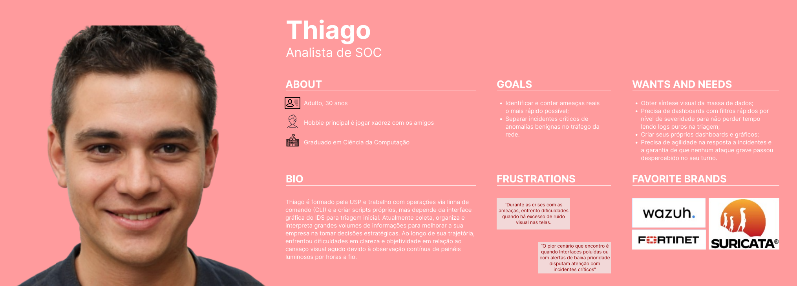
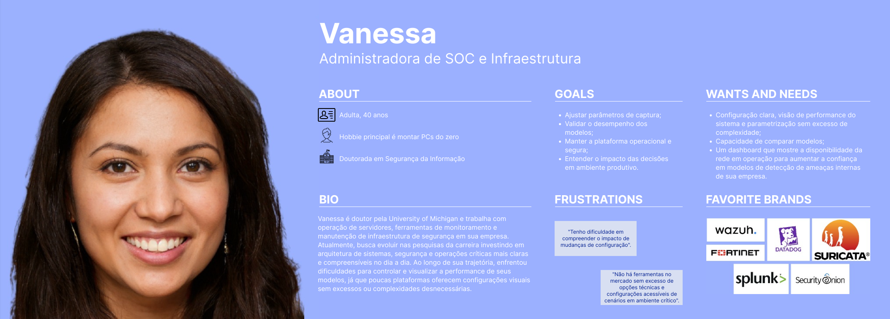
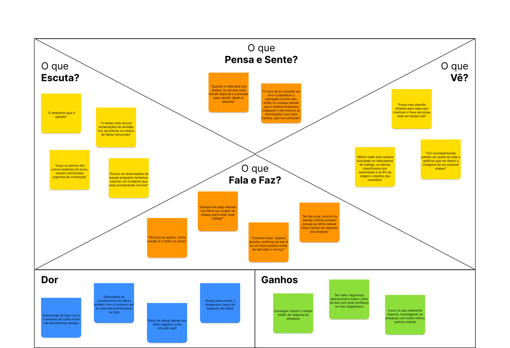

# Entrega 3 — Personas, mapa de empatia, contexto de uso e jornada

**Data:** 27/08/2026  
**Status:** 🟨 em andamento  
**Responsabilidade:** 1 persona por integrante; 1 mapa de empatia, 1 contexto de uso consolidado e 1 jornada por equipe (salvo orientação diferente do docente).

## Objetivo da atividade

Representar grupos de usuários de forma útil para decisões de design. Persona não é personagem decorativo: suas características devem alterar requisitos, prioridades, linguagem, fluxos ou critérios de avaliação.

## Atenção a projetos técnicos

Em TCCs sem interface original, a persona pode representar um **profissional que se apropria da contribuição técnica**: DBA, analista, cientista de dados, administrador, pesquisador, técnico, operador, gestor ou especialista de domínio.

Não escolha um perfil apenas porque “parece combinar” com a tecnologia. Explique **qual objetivo esse perfil teria e qual parte da contribuição do TCC produziria valor para ele**. Se ainda for hipótese, mantenha como hipótese/proto-persona a validar.

Também considere papéis diferentes quando houver tarefas distintas, por exemplo:

- operador que executa análises;
- administrador que configura e gerencia permissões;
- especialista que interpreta resultados;
- gestor que consulta relatórios e decide;
- auditor que revisa histórico.

## Entradas da Entrega 1

| Item da Entrega 1 | Status inicial | Evidência disponível agora | Como será tratado nesta entrega |
|---|---|---|---|
| H03 — perfis diretos (SOC, SysAdmins, Gestores) | H | O projeto prevê analistas, administradores e gestores como atores relevantes do processo de segurança de rede | incorporado como base das personas P01 e P02 |
| H04 — analista monitora tráfego e interpreta alertas em tempo real | H | A atividade de monitoramento é a mais frequente e crítica, conforme A01 e A02 | base para a persona primária P01 |
| H05 — administrador ajusta parâmetros de captura e algoritmo | H | A configuração de pipeline e seleção de modelos é tarefa individual do ambiente de operação | base para a persona secundária P02 |
| H06 — gestor avalia relatórios e decide investimentos | H | Existe necessidade de visão consolidada e relatórios executivos | mantido como stakeholder, mas não como foco principal do design |
| H07 — usuários entendem termos técnicos, mas precisam de síntese visual | H | A análise concorrencial reforça a necessidade de dashboards e filtros por severidade | incorporado aos requisitos da interface |
| H08 — em crise, o sistema deve reduzir ruído visual e priorizar severidade | H | Fortinet e Wazuh usam painéis com priorização visual e filtros hierárquicos | orienta o design da persona P01 |
| H15–H18 — contexto operacional, hardware, Dark Mode e hierarquia de papéis | H | O uso ocorre em SOCs e estações de trabalho com pressão de tempo e múltiplos monitores | incorporado ao contexto de uso |

## 1. Personas

### Persona P01 — {{nome fictício}}
<!-- @Adelgrin = Analista SOC -->
**Autor(a):** {{nome — matrícula}}  
**Tipo:** primária / secundária  
**Base de evidências:** entrevista / questionário / literatura / observação / proto-persona a validar / combinação  
**Hipóteses da Entrega 1 relacionadas:** {{H01, H02 ou —}}

| Campo | Descrição |
|---|---|
| Faixa etária / contexto relevante | {{somente o que impacta o uso}} |
| Ocupação/papel | {{...}} |
| Conhecimento do domínio | {{...}} |
| Experiência tecnológica | {{...}} |
| Objetivos | {{...}} |
| Necessidades | {{...}} |
| Dores/frustrações | {{...}} |
| Motivadores | {{...}} |
| Restrições/acessibilidade | {{...}} |
| Ambiente típico de uso | {{...}} |
| Comportamentos relevantes | {{...}} |

**Decisões de design influenciadas por P01:**

- {{...}}

### Persona P02 — Vanessa Nolasco

**Autor(a):** Marcela Nalesso — 22.222.011-3  
**Tipo:** secundária  
**Base de evidências:** proto-persona a validar com base em hipóteses da Entrega 1 (H05, H16, H17, H18), análise de concorrência e contexto de uso operacional  
**Hipóteses da Entrega 1 relacionadas:** H05, H16, H17, H18

| Campo                             | Descrição                                                                                                                                              |
| --------------------------------- | ------------------------------------------------------------------------------------------------------------------------------------------------------ |
| Faixa etária / contexto relevante | 30 a 45 anos, atua em empresas com infraestrutura de rede e ambiente digital crítico.                                                                  |
| Ocupação/papel                    | Administradora de SOC e Infraestrutura / responsável por configurar o pipeline de monitoramento e os algoritmos de classificação.                      |
| Conhecimento do domínio           | Conhecimento alto em arquitetura de rede, servidores, políticas de segurança e operação de sistemas críticos.                                          |
| Experiência tecnológica           | Experimentada em operação de servidores, ferramentas de monitoramento e manutenção de infraestrutura de segurança.                                     |
| Objetivos                         | Ajustar parâmetros de captura, validar o desempenho dos modelos e manter a plataforma operacional e segura.                                            |
| Necessidades                      | Configuração clara, visão de performance do sistema, parametrização sem excesso de complexidade e capacidade de comparar modelos.                      |
| Dores/frustrações                 | Dificuldade em compreender o impacto de mudanças de configuração, excesso de opções técnicas e necessidade de configurar cenários em ambiente crítico. |
| Motivadores                       | Garantir disponibilidade da rede, manter o sistema em operação e aumentar confiança no modelo de detecção.                                             |
| Restrições/acessibilidade         | Requer operações seguras, atualização controlada e entendimento do impacto das decisões em ambiente produtivo.                                         |
| Ambiente típico de uso            | Estação de trabalho do administrador, acesso a servidores ou plataforma embarcada, com necessidade de monitoramento contínuo.                          |
| Comportamentos relevantes         | Explora parâmetros do sistema, compara métricas de execução e prioriza estabilidade do ambiente sobre experimentação excessiva.                        |

**Decisões de design influenciadas por P02:**

- Incluir uma área de configuração funcional, com parâmetros essenciais e visibilidade do estado do sistema.
- Exibir métricas de desempenho do modelo e da infraestrutura para facilitar ajustes sem ambiguidade.
- Sustentar a ideia de painel modular, permitindo configuração do algoritmo ativo de forma simples e segura.

### Síntese das personas

As personas apresentam papéis distintos, mas complementares. P01 é a persona prioritária porque representa o uso mais frequente e crítico do sistema: monitorar, interpretar e agir rapidamente diante de ameaças reais em tempo real. P02 representa a administração e ajuste do sistema, definindo requisitos de configuração e estabilidade operacional. A diferença central entre elas está na orientação da tarefa: P01 prioriza rapidez e decisão sob pressão; P02 prioriza controle, parametrização e desempenho do ambiente. Isso evita a criação de personas redundantes e assegura que o design atenda tanto à operação quanto à governança técnica.

## 2. Mapa de empatia — equipe

**Persona escolhida:** {{P01}}  
**Justificativa:** {{por que esse perfil é relevante}}

Documente também em texto: o que vê; ouve; diz/faz; pensa/sente; dores; ganhos. Diferencie **evidência** de **hipótese**.

## 3. Contexto de uso — consolidação

| Dimensão | Descrição | Implicação de design |
|---|---|---|
| Usuários | {{...}} | {{...}} |
| Tarefas | {{...}} | {{...}} |
| Equipamentos | {{...}} | {{...}} |
| Ambiente físico | {{...}} | {{...}} |
| Ambiente social/organizacional | {{...}} | {{...}} |
| Papéis/permissões/governança | {{...}} | {{...}} |
| Volume de dados/histórico | {{...}} | {{...}} |

## 4. Jornada do usuário — equipe

**Persona:** {{P01}}  
**Objetivo da jornada:** {{...}}  
**Início e fim da jornada:** {{...}}

| Etapa | Situação/ação | Objetivo | Pensamento/emoção | Dor | Oportunidade de design | Evidência |
|---|---|---|---|---|---|---|
| 1 | {{...}} | {{...}} | {{...}} | {{...}} | {{...}} | {{...}} |

> A jornada pode incluir etapas **antes, durante e depois** do uso do produto. Não transforme a jornada em lista de telas.

## Síntese

Quais necessidades e objetivos devem obrigatoriamente aparecer nos cenários e nas tarefas seguintes?

## Checklist

- [ ] Existe pelo menos uma persona por integrante.
- [ ] As personas não são apenas diferenças demográficas superficiais.
- [ ] Está claro o que é dado real e o que é hipótese/proto-persona.
- [ ] A persona não “validou por ficção” uma hipótese da Entrega 1; afirmações continuam marcadas como hipótese quando não há evidência.
- [ ] Objetivos e dores têm consequência para o design.
- [ ] Contexto de uso está coerente com a Entrega 1.
- [ ] Em TCC sem interface original, a persona possui relação explícita com a contribuição técnica.
- [ ] Papéis administrativos, técnicos e decisórios só foram criados quando possuem objetivos/tarefas diferentes.
- [ ] Jornada possui etapas, dores e oportunidades e não é apenas wireflow.
- [ ] IDs das personas foram adicionados à rastreabilidade.
