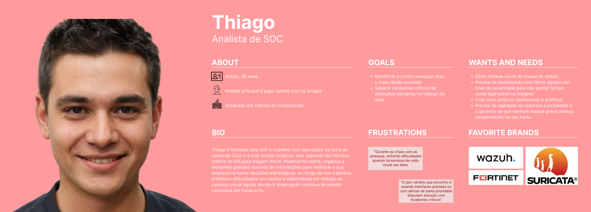
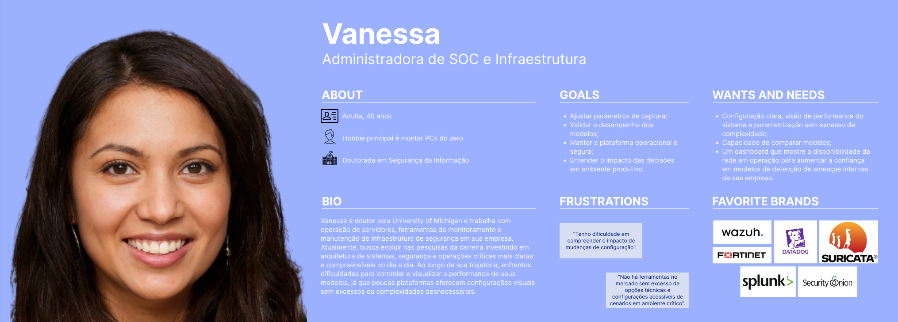
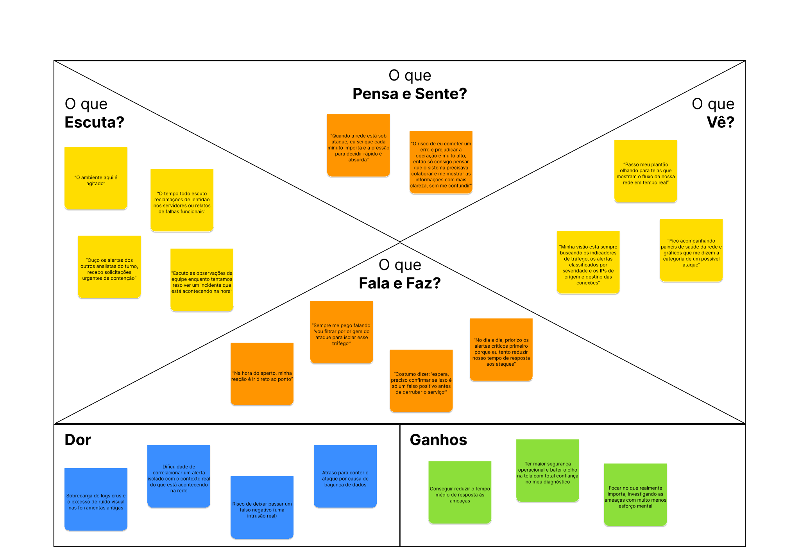

# Entrega 3 — Personas, mapa de empatia, contexto de uso e jornada

**Data:** 27/08/2026
**Status:** `🟩 concluída`
**Responsabilidade:** 1 persona por integrante; 1 mapa de empatia, 1 contexto de uso consolidado e 1 jornada por equipe (salvo orientação diferente do docente).

## Objetivo da atividade

Representar grupos de usuários de forma útil para decisões de design. Persona não é personagem decorativo: suas características devem alterar requisitos, prioridades, linguagem, fluxos ou critérios de avaliação.

## Atenção a projetos técnicos

Em TCCs sem interface original, a persona pode representar um **profissional que se apropria da contribuição técnica**: DBA, analista, cientista de dados, administrador, pesquisador, técnico, operador, gestor ou especialista de domínio.

Não escolha um perfil apenas porque “parece combinar” com a tecnologia. Explique **qual objetivo esse perfil teria e qual parte da contribuição do TCC produziria valor para ele**. Se ainda for hipótese, mantenha como hipótese/proto-persona a validar.

Também considere papéis diferentes quando houver tarefas distintas, por exemplo:

- operador que executa análises;
- administrador que configura e gerencia permissões;
- especialista que interpreta resultados;
- gestor que consulta relatórios e decide;
- auditor que revisa histórico.

## Entradas da Entrega 1

| Item da Entrega 1                                                          | Status inicial | Evidência disponível agora                                                                                    | Como será tratado nesta entrega                                 |
| -------------------------------------------------------------------------- | -------------- | ------------------------------------------------------------------------------------------------------------- | --------------------------------------------------------------- |
| H03 — perfis diretos (SOC, SysAdmins, gestores) | H | Nenhuma: são papéis supostos pela equipe a partir do domínio | Base das personas P01 e P02. A Entrega 03 **constrói** as personas; ela não comprova que esses papéis existam como descritos |
| H04 — o analista monitora o tráfego e interpreta ocorrências em tempo real | H | Nenhuma. A frequência de A01 e a criticidade de A02 são **estimativas da equipe**, não medições | Base da persona P01 (Thiago). Permanece hipótese |
| H05 — o administrador ajusta parâmetros de captura e escolhe o classificador | H | Nenhuma. A alternância do modelo é capacidade definida no TCC; quem a realiza e com que frequência não se sabe | Base da persona **P02 (Vanessa), classificada como primária** — ver a justificativa no quadro “Por que as duas personas são primárias” |
| H06 — o gestor consulta relatórios e decide investimentos | H | Nenhuma | **Decisão de recorte:** o gestor permanece como *stakeholder* no contexto social (seção 3), sem persona própria. Isso **não refuta** H06 |
| H07 — o usuário entende termos técnicos, mas precisa de síntese visual | H | A Entrega 02 mostra que concorrentes **oferecem** síntese e filtros por severidade. Isso descreve os produtos, não a necessidade do nosso público | Orienta decisões de interface, mantido como hipótese |
| H08 — em crise, o sistema deve reduzir ruído visual e priorizar severidade | H | Idem: Fortinet e Wazuh priorizam visualmente, mas isso é escolha dos produtos | Hipótese **de design**, a testar nas Entregas 12–14 |
| H15–H18 — contexto operacional, equipamentos, conforto visual e hierarquia | H | Nenhuma observação de campo foi realizada | Incorporado à seção 3 **como contexto suposto**, com cada afirmação marcada |

> **Nota de revisão (feedback E03, item 3):** a coluna anterior chamava-se “Evidência disponível agora” e continha afirmações do próprio projeto (“a atividade de monitoramento é a mais frequente e crítica”) como se fossem evidência. Repetir uma hipótese num artefato novo **não altera seu grau de comprovação**. A coluna passou a declarar o que de fato temos — que, nesta altura, é quase nada além da observação de interfaces concorrentes.
>
> **H05 e a classificação de P02:** a versão anterior dizia “persona **secundária** P02”, enquanto a ficha de Vanessa e a matriz a identificavam como primária. A contradição foi resolvida: **P02 é primária**, pelos motivos expostos no quadro “Por que as duas personas são primárias”.

## 1. Personas

### Persona P01 — Thiago Albuquerque

**Autor(a):** Lucas Kerr do Amaral — RA 22.123.032-9
**Tipo:** **primária** — prioritária no fluxo de **investigação** (A01 e A02)
**Base de conhecimento:** **proto-persona**. O conteúdo vem de **suposições da equipe** sobre o domínio e da leitura de interfaces concorrentes (Entrega 02). **Nenhum analista foi observado ou entrevistado.** A investigação das características comportamentais está prevista para a Entrega 07
**Hipóteses da Entrega 1 relacionadas:** H03, H04, H07, H08, H15–H18, H28, H29

> **Correção desta revisão (feedback E03, item 3):** a base de evidências dizia “observação / proto-persona a validar”, o que deixava indefinido se houve observação. **Não houve.** A indicação “proto-persona” descreve a **base de conhecimento**, não um terceiro nível de prioridade: P01 é primária *e* suas características ainda precisam ser investigadas. As falas em primeira pessoa no mapa de empatia são **representativas e fictícias**, não transcrições.

| Campo                             | Descrição                                                                                                                                                                                                       |
| --------------------------------- | --------------------------------------------------------------------------------------------------------------------------------------------------------------------------------------------------------------- |
| Nome e idade | Thiago Albuquerque, 30 anos |
| Formação | Ciência da Computação, com certificação de analista de segurança obtida já trabalhando |
| Ocupação/papel | Analista de SOC (nível 2). Monitora o tráfego e interpreta as ocorrências sinalizadas pelo IDS |
| **Rotina de trabalho** | Trabalha em turnos de 8 horas, inclusive noturnos, em escala com outros dois analistas. No início do turno lê a passagem de serviço do turno anterior; ao longo do dia alterna entre acompanhar o painel e investigar ocorrências que chegam por alerta ou por chamado da equipe de infraestrutura. No fim do turno escreve a passagem para quem o substitui |
| **Competências — o que domina** | Protocolos de rede, leitura de captura de pacotes, linha de comando, *scripts* próprios para extrair informação de log. Reconhece padrões de varredura e de negação de serviço |
| **Competências — onde tem dificuldade** | **Não é especialista em aprendizado de máquina.** Não sabe como um classificador chega a uma categoria, nem o que significa “confiança de 0,82”. Também não conhece os parâmetros de captura e de modelo que Vanessa ajusta: quando o comportamento do sistema muda, ele percebe o efeito sem saber a causa. [H] |
| Objetivos | Decidir, com segurança e sem demora, se uma conexão sinalizada corresponde a um incidente real — e encaminhar quem precisa agir. **Não executa a contenção**: ver o quadro “Onde termina a análise e onde começa a contenção” |
| Necessidades | Síntese visual da massa de dados; filtro rápido pelo que exige atenção primeiro; saber **com base em quê** o sistema marcou aquele evento |
| Dores/frustrações | Excesso de ruído visual durante uma ocorrência ativa; ter de reunir manualmente o contexto de uma conexão; não conseguir distinguir o que é rotina do que exige ação |
| Motivadores | Encerrar o turno sabendo que nada grave passou despercebido; não interromper um serviço legítimo por engano |
| Restrições/acessibilidade | Cansaço visual depois de horas diante de painéis luminosos. O **objetivo** é legibilidade e conforto prolongado — a solução visual que o atende é questão em aberto — ver as decisões de design de P01, abaixo |
| Ambiente típico de uso | Sala de SOC na maior parte do tempo; eventualmente de casa, em plantão remoto — ver 3.1 para as diferenças |
| **Relações de trabalho** | Recebe e passa plantão aos outros analistas da escala; recorre a um analista mais experiente quando a ocorrência extrapola o que ele consegue concluir; solicita ação à **equipe de infraestrutura** quando há necessidade de bloqueio; depende de **Vanessa** quando a mudança envolve configuração do pipeline ou do classificador; responde ao coordenador do SOC, que acompanha os indicadores da equipe (*stakeholder*, sem persona) |
| **Interesse pessoal** | Joga xadrez *online* nos intervalos — detalhe que o torna memorável, sem consequência para o design |
| Comportamentos relevantes | Varre a tela em busca de desvio antes de ler qualquer número. Durante uma ocorrência, ignora tudo o que não esteja ligado a ela. Desconfia de resultado que não consegue explicar — e prefere investigar mais a escalar sem certeza |

> **Correção desta revisão (feedback E03, item 2):** “compreende perfeitamente termos técnicos complexos” tornava o perfil absoluto e inútil para o design — uma persona que entende tudo não exige nada da interface. As competências foram delimitadas: **conhecer redes não é conhecer modelos de ML**, e é exatamente nessa fronteira que a interface precisa trabalhar (explicar confiança, categoria e critério — ver RC03 da Entrega 02).
>
> **Retirada também** a menção a decisões estratégicas da empresa que constava da biografia: ela não se sustentava para um analista de nível operacional e não tinha efeito sobre a interface. O que importa dessa relação — a quem ele responde e a quem recorre — está agora na linha “Relações de trabalho”.

**Decisões de design influenciadas por P01:**

- A tela de entrada não abre com linhas de log em texto puro. O panorama vem primeiro; o detalhe vem depois, quando ele decide investigar (RC01, RC04).
- Como Thiago não domina aprendizado de máquina, **categoria prevista, confiança e critério da detecção precisam de explicação na própria tela** — não basta exibir o número (RC03).
- Como ele não configura o sistema, a interface deve **avisá-lo quando o classificador ativo mudar**: o resultado que ele interpreta passou a vir de outro modelo.
- **Objetivo de conforto visual:** legibilidade sustentada ao longo de um turno inteiro, sem fadiga. **Alternativas a investigar:** tema escuro, controle de contraste, redução de áreas luminosas amplas, ou combinação delas.

> **Correção desta revisão (feedback E03, item 7):** a decisão anterior era “Dark Mode como padrão absoluto”. Fadiga visual **não leva automaticamente** a tema escuro — há outras formas de tratar o problema, e a própria seção de hipóteses registra H17 como pendente de validação. O **objetivo** foi separado da **alternativa**: o objetivo é conforto e legibilidade; o tema escuro é uma candidata a testar na Entrega 06 e nas Entregas 12–14.
>
> **Retirado também** “criar seus próprios dashboards e gráficos” da lista de **necessidades** de Thiago. Na Entrega 02, personalização era uma possibilidade **condicionada ao escopo**, observada no Wazuh. Entre uma entrega e outra ela virou necessidade estabelecida, sem nada que justificasse a passagem. Oferecer a função é escolha do concorrente; precisar dela é afirmação sobre o usuário. Permanece como **hipótese**, a investigar na Entrega 07.

### Persona P02 — Vanessa Toledo

**Autor(a):** Marcela Nalesso — RA 22.222.011-3
**Tipo:** **primária** — prioritária no fluxo de **configuração** (A03)
**Base de conhecimento:** **proto-persona**. Construída a partir de hipóteses da Entrega 01 (H05, H16–H18), da análise de concorrentes e do contexto operacional suposto. **Nenhuma administradora foi observada ou entrevistada**
**Hipóteses da Entrega 1 relacionadas:** H05, H16, H17, H18, H27

| Campo                             | Descrição                                                                                                                                              |
| --------------------------------- | ------------------------------------------------------------------------------------------------------------------------------------------------------ |
| Nome e idade | Vanessa Toledo, 40 anos |
| Formação | Engenharia de Computação, com especialização em segurança de redes |
| Ocupação/papel | Administradora de infraestrutura e da plataforma de SOC. Responsável pelo pipeline de captura e pelo classificador ativo |
| **Quando configura** | [H] Em três situações: (1) **mudança planejada**, em janela de manutenção combinada com a operação; (2) **degradação percebida**, quando os analistas relatam volume anormal de ocorrências que não se confirmam; (3) **mudança no ambiente**, quando um novo segmento de rede passa a ser monitorado e o perfil de tráfego muda |
| **Com quem combina uma mudança** | [H] Avisa a equipe de analistas antes de alterar o classificador ativo, porque o que eles veem muda. Alinha a janela com o coordenador do SOC quando a mudança pode afetar a cobertura do turno |
| **De quais informações depende** | Desempenho do classificador atual sobre o tráfego **real** do ambiente, e não apenas a métrica obtida em dataset; carga do equipamento embarcado; histórico do que mudou e quando; retorno dos analistas sobre a qualidade das ocorrências recebidas |
| **Quando desempenho e estabilidade divergem** | [H] Este é o conflito central do seu trabalho: um classificador pode ter métrica melhor e, ao mesmo tempo, gerar carga maior no embarcado ou mais ocorrências não confirmadas. **Ela prioriza a estabilidade da operação** e só adota a mudança quando consegue estimar o efeito. Quando não consegue, prefere não mexer — e essa preferência é uma exigência de design, não um traço de personalidade |
| Objetivos | Manter a plataforma operacional e a detecção adequada ao ambiente, **sabendo o que cada mudança provoca antes de aplicá-la** |
| Necessidades | Ver a consequência de uma alteração **antes** de confirmá-la; comparar o comportamento do classificador atual com o candidato; desfazer uma mudança sem reconstruir a configuração |
| Dores/frustrações | Alterar um parâmetro sem saber o que ele afeta; descobrir o efeito de uma mudança só quando um analista reclama; excesso de opções técnicas sem hierarquia entre o que é corriqueiro e o que é arriscado |
| Motivadores | Que a operação não pare por causa de uma mudança sua; que os analistas confiem no que o sistema mostra |
| Restrições/acessibilidade | Opera em ambiente produtivo: cada alteração afeta pessoas que estão trabalhando naquele momento. Exige confirmação explícita e caminho de volta |
| Ambiente típico de uso | Estação de trabalho própria, com acesso aos servidores e à plataforma embarcada. Trabalha em horário comercial, não em escala de turno — ver 3.1 |
| **Relações de trabalho** | **Thiago** é quem sente o efeito das suas mudanças e quem lhe traz o sinal de que algo está errado. O coordenador do SOC autoriza janelas de manutenção. A equipe de infraestrutura executa bloqueios solicitados pelos analistas — ela não faz parte desse caminho |
| **Interesse pessoal** | Corre meia maratona nos fins de semana — detalhe de identidade, sem efeito sobre o design |
| Comportamentos relevantes | Antes de alterar, procura entender o estado atual. Documenta o que mudou. Prefere uma mudança por vez, para saber a qual atribuir o efeito |

**Decisões de design influenciadas por P02:**

- Área de configuração **separada do fluxo de investigação**, com os parâmetros essenciais e o estado atual do sistema visível.
- **Prevenção de erro:** toda alteração com efeito operacional exige confirmação explícita e informa, antes de confirmar, **o que vai mudar para quem está investigando**.
- **Comunicação de consequência:** ao trocar o classificador, a interface mostra uma comparação entre o modelo atual e o candidato — e torna visível que a mudança ocorreu, também para Thiago.
- **Caminho de volta:** desfazer a última mudança sem refazer a configuração inteira.
- Registro do que mudou, quando e por quem — para que o efeito percebido depois possa ser atribuído a uma causa (relacionado a H31).

**Por que as duas personas são primárias**

> Seção acrescentada na revisão (feedback E03, item 1).

| | P01 — Thiago | P02 — Vanessa |
|---|---|---|
| **Fluxo em que é prioritária** | Investigação (A01, A02) | Configuração (A03) |
| **Objetivo** | Decidir se uma conexão sinalizada é um incidente | Saber o efeito de uma mudança antes de aplicá-la |
| **Pergunta que faz à interface** | “O que aconteceu aqui e posso confiar nisso?” | “O que acontece se eu mudar isto?” |
| **Relação com o tempo** | Decide **durante** uma ocorrência, sob pressão | Decide **antes**, em janela planejada |
| **Consequência de erro** | Um incidente real passa, ou um serviço legítimo é interrompido | A detecção degrada para **toda** a equipe, de uma vez |
| **O que precisa ver** | Contexto da conexão, categoria, confiança, critério | Estado atual, comparação, efeito previsto, caminho de volta |

**Por que a experiência pensada para Thiago não atende Vanessa.** Os objetivos de Vanessa exigem coisas que o fluxo de investigação **não produz**: comparação entre estados do sistema, previsão de efeito, confirmação explícita e reversão. Thiago **lê** o estado do sistema; Vanessa **altera** esse estado. Uma interface que resolve bem a leitura não resolve, por consequência, a alteração — são famílias diferentes de decisão, com critérios de qualidade diferentes. Projetar apenas para Thiago e deixar Vanessa com “o que sobrar” produziria exatamente o problema que ela relata: alterar um parâmetro sem saber o que ele afeta.

**Consequência desta escolha para o projeto.** Haverá **duas áreas distintas** na interface, com critérios próprios de avaliação: a área de investigação será avaliada por **rapidez e acerto na interpretação**; a área de configuração, por **prevenção de erro e clareza da consequência**. As duas se cruzam num ponto: quando Vanessa troca o classificador, Thiago precisa saber disso.

> **O que mudou:** ser menos frequente ou atuar em administração não torna alguém secundário. A classificação depende da relação entre o objetivo da pessoa e o foco do design — e os objetivos de Vanessa exigem atenção própria. A seção “Entradas da Entrega 1”, a síntese e a [matriz](../RASTREABILIDADE.md) foram atualizadas para dizer a mesma coisa.

### Síntese das personas

**P01 — Thiago** é primário e **prioritário no fluxo de investigação**: é ele quem interpreta a classificação e decide o encaminhamento, que é o recorte declarado na Entrega 01 (7.3). **P02 — Vanessa** é primária **no fluxo de configuração**: ela altera o estado do sistema que Thiago lê. A justificativa dessa dupla classificação, e o que ela custa ao projeto, está no quadro “Por que as duas personas são primárias”.

**O que precisa aparecer nos cenários e nas tarefas por causa de Thiago:** interpretar sob pressão, com contexto suficiente e critério visível; distinguir rotina de exceção; registrar a decisão; encaminhar a quem age.

**O que precisa aparecer por causa de Vanessa:** conhecer o estado atual antes de alterar; comparar alternativas; **ver a consequência antes de confirmar**; desfazer; e tornar visível, para quem investiga, que algo mudou. Essas necessidades têm o mesmo peso das de Thiago e não devem desaparecer no fechamento do documento — ver 5.

## 2. Mapa de empatia — equipe

**Persona escolhida:** P01  
**Justificativa:** P01 concentra o caso de uso mais crítico e frequente da proposta, em que o analista precisa interpretar rapidamente sinais de intrusão e decidir sem perder tempo. Esse perfil é o mais relevante para validar a usabilidade do dashboard e a prioridade de informação.

- **O que vê:** “Passo meu plantão olhando para telas que mostram o fluxo da nossa rede em tempo real”, “Fico acompanhando painéis de saúde da rede e gráficos que me dizem a categoria de um possível ataque” e “Minha visão está sempre buscando os indicadores de tráfego, os alertas classificados por severidade e os IPs de origem e destino das conexões”.
- **O que ouve:** “O ambiente aqui é agitado”, “O tempo todo escuto reclamações de lentidão nos servidores ou relatos de falhas funcionais”, “Ouço os alertas dos outros analistas do turno, recebo solicitações urgentes de contenção” e “Escuto as observações da equipe enquanto tentamos resolver um incidente que está acontecendo na hora”.
- **O que diz/faz:** “Na hora do aperto, minha reação é ir direto ao ponto”, “Sempre me pego falando: ‘vou filtrar por origem do ataque para isolar esse tráfego’”, “Costumo dizer: ‘espera, preciso confirmar se isso é só um falso positivo antes de derrubar o serviço’” e “No dia a dia, priorizo os alertas críticos primeiro porque eu tento reduzir nosso tempo de resposta aos ataques”.
- **O que pensa/sente:** “Quando a rede está sob ataque, eu sei que cada minuto importa e a pressão para decidir rápido é absurda” e “O risco de eu cometer um erro e prejudicar a operação é muito alto, então só consigo pensar que o sistema precisava colaborar e me mostrar as informações com mais clareza, sem me confundir”.
- **Dores:** Sobrecarga de logs crus e o excesso de ruído visual nas ferramentas antigas; dificuldade de correlacionar um alerta isolado com o contexto real do que está acontecendo na rede; risco de deixar passar um falso negativo (uma intrusão real) e atraso para conter o ataque por causa de bagunça de dados.
- **Ganhos:** Conseguir reduzir o tempo médio de resposta às ameaças; ter maior segurança operacional e bater o olho na tela com total confiança no meu diagnóstico e focar no que realmente importa, investigando as ameaças com muito menos esforço mental.

**Natureza das falas acima:** são **falas representativas fictícias**, escritas pela equipe a partir da persona. **Não são transcrições** de nenhum participante. Elas organizam o entendimento do grupo sobre o que Thiago provavelmente percebe e diz; não são dados.

**Evidência × hipótese — corrigido nesta revisão (feedback E03, item 3):**

| Afirmação | Classificação **correta** | Observação |
|---|---|---|
| A01 (observar o estado da rede) é a atividade mais frequente | **[H11] Hipótese** | Foi formulada como hipótese na Entrega 01. Reaparecer no mapa de empatia **não a transforma em evidência** |
| A02 (investigar uma conexão sinalizada) é a mais crítica | **[H12] Hipótese** | Idem. A criticidade é uma estimativa da equipe a partir da consequência de erro |
| Há necessidade de síntese visual para correlacionar métricas | **[H13] Hipótese** | Idem |
| A interface deve reduzir carga cognitiva e permitir decisão rápida sob pressão | **[H08/H29] Hipótese de design** | A testar nas Entregas 12–14 |
| Conforto visual prolongado é necessário | **[H17] Hipótese** | O **objetivo** é legibilidade; tema escuro é **uma alternativa** entre outras — ver as decisões de design de P01 |
| O que o mapa registra são percepções atribuídas a um personagem construído | **[F] Fato sobre o artefato** | É a única coisa aqui que podemos afirmar sem reservas |

> **O que estava errado:** a versão anterior listava a frequência de A01, a criticidade de A02 e a necessidade de síntese visual sob o rótulo **“Evidência”**. As três foram formuladas como hipóteses na Entrega 01 e continuam sendo. **A persona organiza o entendimento da equipe; ela não é uma participante que confirma as próprias características.** O mesmo vale para a matriz: o registro de H08 dizia que “as personas validaram”, e foi corrigido em [`../RASTREABILIDADE.md`](../RASTREABILIDADE.md) para distinguir hipótese, decisão de projeto e dado coletado.
>
> **Sobre a contenção:** a fala “antes de derrubar o serviço” e o ganho “total confiança no meu diagnóstico” são **expectativas do personagem**, não promessas da solução. Thiago não derruba serviço (ver o quadro “Onde termina a análise e onde começa a contenção”), e exibir a confiança do modelo **não comprova** um incidente: ajuda a formar um julgamento, com seus limites à vista.

## 3. Contexto de uso — consolidação

| Dimensão | Descrição | Implicação de design |
|---|---|---|
| Usuários | **Thiago** (analista, escala de turno, inclusive noturno) e **Vanessa** (administradora, horário comercial). Não trabalham no mesmo horário nem com a mesma urgência | A interface precisa servir a dois regimes: leitura sob pressão e alteração planejada |
| Tarefas | Observar o estado da rede (A01), investigar uma conexão sinalizada (A02), ajustar o classificador ativo (A03) | Fluxo de investigação com detalhamento progressivo; área de configuração separada, com prevenção de erro |
| Equipamentos | [H16] **Interface:** notebook ou desktop com navegador, um ou dois monitores. **Processamento:** plataforma embarcada, que o usuário não opera diretamente | Projetar para tela de desktop. A restrição do embarcado chega ao usuário apenas como possível **latência** no que ele vê (Entrega 01, 9.3) |
| Ambiente físico — **SOC** | [H15] Sala com iluminação controlada e mais baixa que a de escritório; vários analistas no mesmo espaço; ruído de conversa constante; **interrupções frequentes** por chamado de colega; permanência de horas diante das telas; monitores lado a lado, um deles costuma ficar com o painel aberto em segundo plano | Contraste alto e texto legível em ambiente escuro; a tela precisa ser **retomável após interrupção** — ao voltar, Thiago precisa reconhecer onde estava, qual filtro estava ativo e o que já havia concluído; informação importante não pode depender de som |
| Ambiente físico — **plantão remoto (home office)** | [H] Um monitor em vez de vários; iluminação não controlada, que varia ao longo do dia; sem colega ao lado para consultar; interrupções de natureza doméstica; depende de canal digital para pedir ajuda ou solicitar ação | **O painel precisa funcionar em uma única tela**, sem supor que outro monitor carrega o contexto. O conforto visual não pode depender de uma sala escura. E, sem colega ao lado, a tela precisa ser mais autoexplicativa — o que reforça RC03 |
| Ambiente físico — **estação da administradora** | [H] Estação própria, horário comercial, sem a pressão de turno. Trabalha com a documentação do ambiente aberta ao lado | A configuração pode exigir mais leitura e mais passos que a investigação: o que ela precisa não é rapidez, é **certeza** |
| Ambiente social — **quem colabora** | [H18] Analistas da mesma escala trocam informação durante o turno e na passagem de plantão. Thiago recorre a um analista mais experiente quando não consegue concluir | A decisão registrada precisa ser legível por outra pessoa: a passagem de plantão é um uso real do histórico |
| Ambiente social — **quem solicita resposta** | [H] A operação e os usuários da rede reportam lentidão ou falha; esse relato é **uma das origens do indício** que inicia a investigação (H30), ao lado do alerta do sistema | A interface precisa permitir entrar na investigação **pelos dois caminhos**: a partir de uma ocorrência sinalizada e a partir de um ativo ou serviço sobre o qual alguém reclamou |
| Ambiente social — **como ocorre o encaminhamento** | [H] Confirmado um incidente, Thiago **solicita ação à equipe de infraestrutura** (bloqueio, isolamento) ou escala para um responsável. A ação acontece **fora desta interface** — ver o quadro “Onde termina a análise e onde começa a contenção” | O sistema precisa produzir um registro que **sirva à pessoa que vai agir**: o que foi observado, qual a conclusão e com base em quê |
| Ambiente social — **quem decide uma mudança com impacto operacional** | [H] **Vanessa**, para configuração do pipeline e do classificador, em janela combinada. O **coordenador do SOC** (*stakeholder*, sem persona) autoriza a janela e acompanha os indicadores da equipe | Alterações de configuração exigem confirmação explícita e aviso a quem está investigando |
| **Coordenação entre Thiago e Vanessa** | [H] Em dois sentidos: **(a)** quando Thiago percebe volume anormal de ocorrências que não se confirmam, ele é a origem do sinal que leva Vanessa a reavaliar o classificador; **(b)** quando Vanessa troca o classificador, muda o que Thiago vê — categoria e confiança passam a vir de outro modelo | **Esta é a ligação que o projeto precisa tornar visível:** a interface deve indicar **qual classificador está ativo** e **desde quando**, para que Thiago possa atribuir uma mudança de comportamento a uma causa. Sem isso, cada um acompanha o efeito do outro sem saber |
| Papéis/níveis | [H18] **L1, L2 e administrador não são equivalentes:** L1 faz a triagem inicial e decide o que merece aprofundamento; L2 (Thiago) investiga a fundo e conclui; o administrador (Vanessa) **não investiga ocorrência** — cuida do sistema que as produz. A hipótese da hierarquia **permanece aberta**: retirar o gestor do elenco de personas foi decisão de recorte e não a refuta | O projeto trata o fluxo de **L2** como referência. A existência de L1 implica que uma ocorrência pode chegar a Thiago **já com triagem prévia** — o que ele precisa poder ver |
| Volume de dados/histórico | [H31] Volume alto de tráfego e necessidade suposta de retenção para auditoria. **Não levantamos** qual retenção, para quem e com qual finalidade | Agrupar ocorrências e oferecer histórico filtrado, em vez de dados brutos como primeira visão |

> **Correção desta revisão (feedback E03, item 6):** a descrição anterior resumia o contexto físico a “SOC, salas de TI e ambientes de operação com iluminação controlada”, o que não permitia derivar nenhuma decisão de design. O **home office** aparecia na ficha de P01 e desaparecia do contexto consolidado; agora tem linha própria, com as diferenças que importam. O **ambiente agitado e a comunicação constante**, que o mapa de empatia menciona, foram conectados à descrição física (interrupção e retomada) e à organizacional (quem colabora, quem solicita, quem autoriza). **L1, L2 e administrador** deixaram de aparecer como papéis equivalentes. O **gestor** permanece como *stakeholder*, sem persona e sem elenco ampliado.

## 4. Jornada do usuário — equipe

**Persona:** P01 — Thiago Albuquerque
**Objetivo da jornada:** decidir se uma conexão sinalizada corresponde a um incidente real e **encaminhar quem precisa agir**, antes que a ocorrência comprometa a operação.
**Início:** antes de abrir o painel, quando um indício o faz interromper o que estava fazendo.
**Fim:** depois de fechar o painel, quando ele consegue retomar o trabalho anterior ou transferir a investigação a outra pessoa.

> **Por que não há uma jornada de Vanessa nesta entrega:** a jornada consolidada é uma por equipe e concentra-se no fluxo de investigação. As necessidades de Vanessa estão representadas no quadro “Por que as duas personas são primárias”, na seção 3 (coordenação entre perfis) e nas etapas 4 e 7 abaixo, onde o trabalho dela cruza o de Thiago.

**Onde termina a análise e onde começa a contenção**

> Seção acrescentada na revisão (feedback E03, item 5).

| O que Thiago faz | Onde | Quem executa |
|---|---|---|
| **Interpreta** a classificação à luz do contexto da conexão | Nesta interface | Thiago |
| **Decide**: descarta como falso positivo, confirma como incidente, ou marca como indefinido e segue investigando | Nesta interface | Thiago |
| **Registra** a decisão e o que a fundamentou | Nesta interface | Thiago |
| **Solicita a ação** — bloqueio, isolamento, derrubada de serviço | **Fora desta interface**: chamado, canal da equipe, ou outro sistema | Equipe de infraestrutura, ou responsável escalado |
| **Pede revisão da configuração** quando o problema parece estar no classificador, não no tráfego | **Fora desta interface** | Vanessa (P02) |

O objetivo da jornada foi reescrito de “confirmar e mitigar” para “decidir e encaminhar”. **Isso não acrescenta nem retira funcionalidade do projeto** — ajusta o que o documento promete ao que as oportunidades de design efetivamente descrevem, que são filtros, contexto, histórico e indicadores. A fala “derrubar o serviço”, no mapa de empatia, é **expectativa do personagem** sobre a consequência do seu pedido, não uma ação que ele executa aqui.

| Etapa | Situação/ação | Objetivo | Pensamento/emoção | Dor | Oportunidade de design | Evidência |
|---|---|---|---|---|---|---|
| 1 | **Antes** — Thiago está no meio do turno, escrevendo a análise de uma ocorrência anterior, quando dois sinais chegam quase juntos: o painel marca um volume incomum de conexões a partir de um mesmo segmento, e um colega da operação comenta que o portal interno está lento. **O que está em risco:** o portal é usado pelo atendimento; se cair, as pessoas que dependem dele param de trabalhar | Decidir se interrompe o que estava fazendo | “Pode ser pico de uso. Mas vieram dois sinais ao mesmo tempo” | Ele precisa largar uma tarefa pela metade sem saber se vale a pena | **Entrar na investigação pelos dois caminhos** — pela ocorrência sinalizada e pelo serviço sobre o qual reclamaram. E **deixar a tarefa anterior recuperável** | [H30] Hipótese de processo |
| 2 | **Durante** — Abre o painel e procura, primeiro, uma resposta binária: há algo fora do padrão agora? | Separar rotina de exceção | “Isso é movimento normal desse horário ou não?” | Dados sem hierarquia obrigam a ler tudo para descobrir o que importa | Visão de entrada com poucos indicadores, que responda “há algo anômalo?” antes de mostrar o detalhe (RC01) | [H08, H11] |
| 3 | **Durante** — Restringe ao segmento e ao período e examina as conexões sinalizadas: origem, destino, serviço, volume, duração, categoria prevista e confiança | Reunir o contexto da conexão | “Quem é essa origem? Já falou com esse destino antes?” | Sem recortes prontos, montar a consulta consome o tempo da interpretação | Recortes prontos por origem, destino e fluxo; **contagem de resultados após cada filtro** (RC02, RC04) | [H13] |
| 4 | **Durante** — **Ponto de decisão.** Thiago confronta o que o modelo afirma com o que conhece do ambiente. **O que ele procura:** se aquela origem tem histórico com aquele destino; se o volume destoa do comportamento habitual daquele ativo; **com base em qual atributo** o modelo classificou assim; e se há outras conexões com o mesmo padrão. **O que continua incerto:** uma confiança de 0,7 não lhe diz se é ataque — diz que o modelo hesitou. **Quando ele consulta alguém:** se o padrão não se parece com nada que conheça, chama o analista mais experiente; se várias ocorrências parecidas não se confirmam, suspeita do **classificador** e aciona Vanessa | Formar um julgamento que ele consiga sustentar | “Não posso agir sem certeza — e também não posso ficar aqui a noite toda” | Interpretar errado custa nos dois sentidos: um incidente passa, ou um serviço legítimo é interrompido | **Mostrar o critério, não só o resultado:** categoria, confiança, atributos que pesaram e **qual classificador está ativo** — cada um identificado como coisa distinta (RC03). Permitir marcar como **indefinido** e continuar | [H12] Hipótese. “Total confiança no diagnóstico” é **expectativa**, não promessa |
| 5 | **Durante** — Conclui que é uma varredura real contra o portal e **encaminha**: registra a conclusão, abre o chamado para a equipe de infraestrutura com o que observou, e avisa o turno | Transferir a ação a quem pode executá-la | “Preciso que isso chegue pronto para quem vai agir” | Se o registro não for legível por outra pessoa, ele vira gargalo — todos voltam a perguntar a ele | Exportar o contexto da ocorrência num formato que **sirva à pessoa que vai agir**, não só ao próprio sistema | [H] Ação executada **fora** desta interface — ver o quadro “Onde termina a análise e onde começa a contenção” |
| 6 | **Depois** — **Acompanha o efeito fora do painel.** Volta ao painel depois para ver se o padrão cessou após a ação da infraestrutura. Comunica o resultado ao colega que relatou a lentidão | Saber se o problema terminou | “Parou? Ou só mudou de origem?” | Sem comparar antes e depois, ele não sabe se a ação funcionou | **Acompanhar uma ocorrência encerrada**: comparar o comportamento do ativo antes e depois, sem refazer a investigação do zero | [H] |
| 7 | **Depois** — **Retoma ou transfere.** Volta à análise que havia interrompido — ou, se o turno acabou, escreve a passagem de plantão: o que aconteceu, o que concluiu, o que ficou pendente. Se suspeitou do classificador, deixa o registro para Vanessa | Fechar o ciclo sem perder o que estava fazendo | “O próximo turno precisa entender isso sem me ligar” | O que ficou só na cabeça dele se perde na troca de turno | **O histórico é lido por outra pessoa**, e isso muda o que precisa ser registrado: não só a decisão, mas o que a fundamentou. Recuperar a tarefa interrompida na etapa 1 | [H18, H31] |

> A jornada pode incluir etapas **antes, durante e depois** do uso do produto. Não transforme a jornada em lista de telas.

> **Correção desta revisão (feedback E03, item 4 e Recomendações):**
>
> - **Antes:** a etapa 1 dizia apenas que ele “observa um pico ou alerta”, sem dizer de onde vinha o indício, o que ele estava fazendo, nem o que estava em risco. Agora há duas origens para o indício (coerentes com H30 e com o contexto social), uma tarefa interrompida e um risco concreto para pessoas.
> - **Durante:** a etapa 4 resumia o ponto decisivo em “valida se é falso positivo ou intrusão real”. Agora diz **o que ele procura**, **o que continua incerto** e **quando consulta alguém** — inclusive quando a suspeita recai sobre o próprio classificador, que é onde o trabalho de Vanessa entra.
> - **Depois:** “o alerta é encerrado, registrado e pode ser revisado” descrevia o estado do registro, não o que a pessoa faz. As etapas 6 e 7 descrevem acompanhamento fora do painel, comunicação do resultado e retomada ou transferência do trabalho.
> - **Referência retirada:** H05 aparecia como evidência do encerramento do alerta por Thiago. H05 trata de **configuração administrativa** e não sustenta essa etapa; foi substituída por H18 e H31.

## Síntese

**Do fluxo de investigação (P01 — Thiago):**

- Perceber, antes de qualquer detalhe, se há algo fora do padrão;
- Entrar na investigação tanto por uma ocorrência sinalizada quanto por um serviço sobre o qual alguém reclamou;
- Reunir o contexto de uma conexão sem montar consulta do zero, sabendo quantos itens restaram a cada filtro;
- Distinguir **categoria prevista**, **confiança**, **severidade** e **critério da detecção** — e saber **qual classificador** produziu o resultado;
- Registrar a decisão, inclusive “indefinido”, com o que a fundamentou;
- Produzir um encaminhamento legível por quem vai agir **fora** desta interface;
- Retomar a tarefa interrompida e transferir o trabalho na passagem de plantão.

**Do fluxo de configuração (P02 — Vanessa), com o mesmo peso:**

- Conhecer o estado atual do sistema antes de alterar qualquer coisa;
- Comparar o classificador ativo com o candidato sobre o tráfego **real** do ambiente;
- **Ver a consequência de uma mudança antes de confirmá-la**, inclusive o que muda para quem está investigando;
- Desfazer a última mudança sem reconstruir a configuração;
- Registrar o que mudou, quando e por quem, para que um efeito percebido depois possa ser atribuído a uma causa.

**Da coordenação entre os dois:**

- Thiago precisa **ver que o classificador mudou** e desde quando;
- Vanessa precisa **receber o sinal** de que as ocorrências não estão se confirmando.

Essas necessidades orientam o projeto da área de investigação **e** da área de configuração. Nenhuma delas confirma uma hipótese: elas dizem o que o projeto precisa tratar, e o que a Entrega 07 precisa verificar.

> **Correção desta revisão (feedback E03, Recomendações):** o fechamento anterior enfatizava quase exclusivamente a operação de Thiago, o que era incoerente com manter Vanessa como persona primária. As necessidades dela ganharam visibilidade própria.

## Checklist

- [ ] Existe pelo menos uma persona por integrante.
- [ ] As personas não são apenas diferenças demográficas superficiais.
- [ ] Está claro o que é dado real e o que é hipótese/proto-persona.
- [ ] A persona não “validou por ficção” uma hipótese da Entrega 1; afirmações continuam marcadas como hipótese quando não há evidência.
- [ ] Objetivos e dores têm consequência para o design.
- [ ] Contexto de uso está coerente com a Entrega 1.
- [ ] Em TCC sem interface original, a persona possui relação explícita com a contribuição técnica.
- [ ] Papéis administrativos, técnicos e decisórios só foram criados quando possuem objetivos/tarefas diferentes.
- [ ] Jornada possui etapas, dores e oportunidades e não é apenas wireflow.
- [ ] IDs das personas foram adicionados à rastreabilidade.
